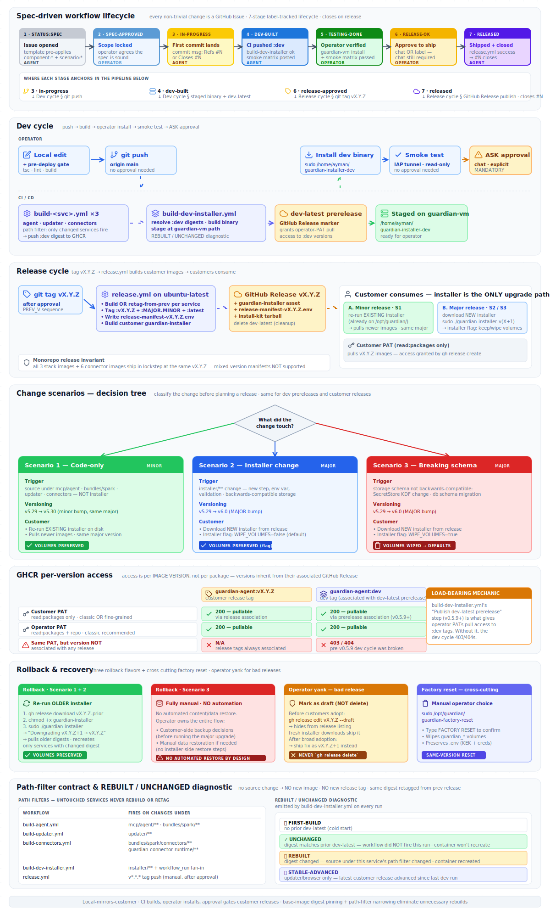

# Guardian CI/CD Guide

> Build, test, prerelease, release. Pipeline mechanics, workflow
> contracts, change scenarios, customer upgrade flows, approval gates.
>
> [CLAUDE.md](../CLAUDE.md) references this document for operational
> details. The **agent-behavior contracts** (when I MUST ask the
> operator, what I MUST share before approval) live in CLAUDE.md; the
> **pipeline mechanics** they enforce live here. If you're reading this
> as a future maintainer, treat both files as load-bearing — one
> describes WHAT the system does; the other describes WHAT THE AGENT
> DOES while helping build/release the system.

## Contents

- [Visual overview](#visual-overview)
- [Overview](#overview)
- [Change scenarios — versioning + customer upgrade UX](#change-scenarios)
  - [Scenario 1 — Code-only change (installer unchanged)](#scenario-1)
  - [Scenario 2 — Installer change (no breaking storage migration)](#scenario-2)
  - [Scenario 3 — Backwards-incompatible change (volume reset)](#scenario-3)
  - [Factory reset (cross-cutting)](#factory-reset)
  - [Decision tree](#decision-tree)
  - [Implementation status](#scenario-implementation-status)
- [Release-readiness criteria (the use-case-completion gate)](#release-readiness-criteria-the-use-case-completion-gate)
- [Deprecation policy](#deprecation-policy)
- [Customer onboarding flow (first-time install)](#customer-onboarding-flow-first-time-install)
- [Rollback procedure](#rollback-procedure)
  - [Tag immutability + accidental tag deletion](#tag-immutability--recovery-from-accidental-tag-deletion)
- [guardian-updater in the release loop](#guardian-updater-in-the-release-loop)
- [Pre-release / beta channel (future)](#pre-release--beta-channel-future)
- [The two installers](#the-two-installers)
  - [Monorepo release invariant](#monorepo-release-invariant)
- [Image tag convention](#image-tag-convention)
- [GHCR per-version access (the dev cycle's load-bearing mechanic)](#ghcr-per-version-access)
  - [PAT recipes (customer vs operator)](#pat-recipes)
- [Per-service path-filter contract](#per-service-path-filter-contract)
- [`docker compose pull` "Pulled" output is NOT a fresh build](#docker-compose-pull-pulled-output-is-not-a-fresh-build)
- [REBUILT / UNCHANGED diagnostic](#rebuilt--unchanged-diagnostic)
- [Base-image digest pinning](#base-image-digest-pinning)
- [Build cache observability](#build-cache-observability)
- [Install location, volumes, recovery utilities](#install-location-volumes-recovery-utilities)
- [Workflow file layout](#workflow-file-layout)
  - [The `build-and-push-dev-image` composite action](#the-build-and-push-dev-image-composite-action)
- [Build & release workflow (mechanics)](#build--release-workflow-mechanics)
  - [PR cycle (vs main-push cycle)](#pr-cycle-vs-main-push-cycle)
- [Spec-driven workflow](#spec-driven-workflow)
- [guardian-vm runner prerequisites](#guardian-vm-runner-prerequisites)
  - [Self-hosted runner capacity](#self-hosted-runner-capacity)
- [Code → VM contract](#code--vm-contract)
- [Smoke-test commands (read-only, via IAP tunnel)](#smoke-test-commands)
- [`installer/build-guardian-installer.sh` env-var contract](#installerbuild-guardian-installersh-env-var-contract)
- [Image digest pinning contract (customer compose)](#image-digest-pinning-contract-customer-compose)
- [Image signing, SBOM, provenance (future)](#image-signing-sbom-provenance-future)
- [CI/CD failure modes + recovery playbook](#cicd-failure-modes--recovery-playbook)
- [CI/CD pipeline observability](#cicd-pipeline-observability)
- [Forbidden going forward (consolidated)](#forbidden-going-forward-consolidated)

## Visual overview

The diagram below summarizes the full pipeline as documented in this file: dev cycle, release cycle, the three change scenarios, GHCR per-version access, rollback paths, and the REBUILT/UNCHANGED diagnostic. **The diagram is a scaffold; this document has the detail.** When reading a section below, refer back to the diagram for spatial context.



The diagram is generated from [`cicd-pipeline.svg`](cicd-pipeline.svg) in this same directory. Edit the SVG when the pipeline changes substantively — the visual + textual descriptions should stay in lockstep, same as CHANGELOG and release-notes.ts.

**Section-to-diagram map**:

| Diagram section | Doc section |
|---|---|
| **Spec-driven workflow lifecycle (top — NEW in v0.5.19)** | [Spec-driven workflow](#spec-driven-workflow) + CLAUDE.md § Spec-driven workflow |
| Dev cycle | [Overview](#overview) + [Build & release workflow mechanics](#build--release-workflow-mechanics) + [Per-service path-filter contract](#per-service-path-filter-contract) |
| Release cycle | [Build & release workflow mechanics](#build--release-workflow-mechanics) + [The two installers](#the-two-installers) + [Monorepo release invariant](#monorepo-release-invariant) |
| Three change scenarios + decision tree | [Change scenarios](#change-scenarios) |
| GHCR per-version access matrix | [GHCR per-version access](#ghcr-per-version-access) + [PAT recipes](#pat-recipes) |
| Rollback & recovery | [Rollback procedure](#rollback-procedure) + [Install location, volumes, recovery utilities](#install-location-volumes-recovery-utilities) |
| Path-filter contract + REBUILT/UNCHANGED diagnostic | [Per-service path-filter contract](#per-service-path-filter-contract) + [REBUILT / UNCHANGED diagnostic](#rebuilt--unchanged-diagnostic) |

The diagram now reads top-to-bottom as **lifecycle → pipeline**: the top section shows the issue's 7-stage lifecycle (spec → released); each downstream section shows what happens AT each lifecycle stage. Mental model: the lifecycle is the OUTER state machine; the pipeline sections are the INNER mechanics that fire on lifecycle transitions.

## Overview

Guardian ships to customers as a Docker Compose stack of 3 stack-level images (agent, updater, browser) plus N per-instance connector containers managed dynamically by guardian-updater (built from the connector-runtime base image + 5 per-connector images). Two distribution flavors:

| Flavor | For | Built by | Distributed via | Pull access |
|---|---|---|---|---|
| **Customer release** | Production customers | `release.yml` on `v*.*.*` tag push | GitHub Release `vX.Y.Z` + customer installer asset | Customer PAT (`read:packages` only) |
| **Dev prerelease** | Operator (guardian-vm) | `build-dev-installer.yml` on every push to main | `dev-latest` GitHub prerelease + `/home/ayman/guardian-installer-dev` on guardian-vm | Operator PAT (`read:packages` only) via prerelease association |

Both installers execute the **same script body** (`installer/guardian-installer.template.sh`). The only difference is the digest manifest baked in at build time — customer releases pin to immutable `vX.Y.Z` content, dev prereleases pin to the rolling `:dev` digests.

The CI/CD pipeline has three sequential steps per push to main:

1. **Per-service build** — `build-agent.yml` / `build-updater.yml` / `build-connectors.yml`. Each fires ONLY when its service's source changed. Pushes `:dev` image tag.
2. **Dev installer build + prerelease publish** — `build-dev-installer.yml`. Fans in from any of the above (`workflow_run`) OR fires on `installer/**` changes. Resolves current `:dev` digests, builds `guardian-installer-dev`, stages at `/home/ayman/guardian-installer-dev`, publishes `dev-latest` prerelease (load-bearing for operator-PAT pull access).
3. **Customer release** — `release.yml`. Fires ONLY on `v*.*.*` tag push, AFTER explicit operator approval in chat. Builds customer images (conditional rebuild via path diff against previous tag), publishes GitHub Release with the customer installer asset, deletes `dev-latest` prerelease.

Operator drives every install on guardian-vm. CI never installs. The IAP tunnel is for **read-only smoke testing AFTER the operator's install** — never for `tar+scp`, `docker compose build`, or any path that mutates VM source.

## Change scenarios

Every change to the codebase falls into one of three scenarios. The scenario determines: versioning policy, what artifacts we ship, what the customer downloads + runs, and whether stored content (volumes) survives. **Identical for dev prereleases and customer releases** — the dev cycle is a faithful mirror of the customer cycle modulo the digest content.

### Scenario 1

**Code-only change. Installer unchanged.** Customer re-runs their EXISTING installer for the upgrade.

**Trigger**: source change under `mcp/agent/**`, `bundles/spark/**`, `updater/**`, `bundles/spark/connectors/**`, or `guardian-connector-runtime/**`. NO change to `installer/**`.

**Versioning**: **MINOR bump within the current major** — `v5.29` → `v5.30`. The installer's major version stays constant; only the right side increments. Customers know "same major = same install ceremony."

**What we ship**:
- New `:v5.30` image tags on GHCR (ONLY for services whose source changed). The path-filter contract guarantees untouched services get NO new image and NO new release tag — `release.yml`'s conditional rebuild retags unchanged services from the previous minor's digests.
- A new GitHub Release `v5.30` containing:
  - The new `release-manifest-v5.30.env` with updated DIGEST_* values.
  - **No new installer binary.** Customers use the installer they already have on disk.

**Customer experience**:
- Customer's existing installer at `/opt/guardian/guardian-installer` reads the latest minor manifest (within current major) on re-run.
- Re-run command: `sudo /opt/guardian/guardian-installer`
- Installer detects existing install at `/opt/guardian/`, prints `Upgrading v5.29 → v5.30 (same major, code-only)`, pulls newer images by digest, restarts services whose digest changed.

**Volume policy**: **PRESERVED**. The customer's stored content (jobs, skills, connector instances, memories, audit log, sessions, secrets, KEK material) survives the upgrade.

**Backwards compatibility**: **REQUIRED**. New code must read state written by the prior minor without migration. If the schema changes, that's Scenario 3 (and gets a MAJOR bump).

**Customer confirmation prompt**: NONE. Upgrade is one-command.

**The "no UI Update button" rule**: there is no in-UI upgrade trigger. Upgrades happen via the installer ONLY (existing for S1, new download for S2/S3). Operators consider in-UI upgrades risk-laden — manual installer runs preserve operator agency at each upgrade point.

**Examples** (in this repo's history under the pre-v0.5.20 model that called these patch bumps): v0.5.6 (installer self-persist — actually a borderline S1/S2 case), v0.5.7 (CI-only), v0.5.11 (CI docs + diagnostic), v0.5.12 (path-filter + digest pinning).

### Scenario 2

**Installer change. Storage migration backward-compatible (or no migration needed).** Customer downloads a NEW installer.

**Trigger**: change under `installer/**` — new install step, new env var, new validation, new compose service, new recovery utility, etc. Often accompanies code changes too.

**Versioning**: **MAJOR bump** — `v5.29` → `v6.0`. Any installer change triggers a major bump because the customer-facing install ceremony differs from the prior major's. Major bumps are the customer's signal to download a new installer.

**What we ship**:
- New `:v6.0` image tags on GHCR (where applicable; same conditional-rebuild logic as Scenario 1).
- A new GitHub Release `v6.0` containing:
  - A **NEW `guardian-installer` binary** with the new install logic + the new digest manifest baked in.
  - The new `release-manifest-v6.0.env`.

**Customer experience**:
- Customer downloads the new installer from the GitHub Release page.
- Runs `sudo ./guardian-installer-v6`. The installer:
  - Detects the existing install at `/opt/guardian/`.
  - Reads `WIPE_VOLUMES=false` flag baked in at build time (Scenario 2 default).
  - Prints `Upgrading v5.29 → v6.0 (major, installer changed; volumes preserved)`.
  - Runs the new install ceremony idempotently against the existing `.env` + volumes (preserves operator-managed lines; rewrites manifest-managed lines).
  - Pulls new images, restarts changed services.

**Volume policy**: **PRESERVED** — explicitly via the installer's `WIPE_VOLUMES=false` flag (baked in at installer-build time for Scenario 2 releases).

**Backwards compatibility**: **REQUIRED**. Existing operator state must work with the new install steps. If the new install would break old state, that's Scenario 3 (same major-bump versioning but `WIPE_VOLUMES=true`).

**Customer confirmation prompt**: NONE. Upgrade is one-command.

**Examples** (in this repo's history under the pre-v0.5.20 model): v0.5.3 (host-side recovery utilities), v0.5.8 (token validation step), v0.5.10 (Accept header fix), v0.5.12 (path-filter + digest pinning — touched both source AND installer).

### Scenario 3

**Backwards-incompatible change. Volume reset required.** Customer downloads a NEW installer; installer's flag triggers volume wipe.

**Trigger**: change where the **stored content schema** is not compatible with the new version. Examples:
- Job definition format change with no auto-migration
- SecretStore key-derivation algorithm change (cannot decrypt old secrets)
- `marketplace.db` / `instances.db` schema change requiring data restructuring
- Substantive identity-model overhaul (multi-user, RBAC)
- Renaming SecretStore key paths in a way that breaks the existing index

**Versioning**: **MAJOR bump** — `v5.29` → `v6.0`. Same versioning shape as Scenario 2; the difference between S2 and S3 is the **installer flag**, not the version number. Customers see a major bump and download a new installer either way; the installer-baked flag tells the install ceremony what to do with volumes.

**What we ship**:
- New `:v6.0` image tags on GHCR (all 5 stack services + connector images rebuilt).
- A new GitHub Release `v6.0` containing:
  - A NEW `guardian-installer` binary with:
    - The new digest manifest.
    - **`WIPE_VOLUMES=true`** flag baked in at build time (Scenario 3 marker).
    - Wipe logic that runs unconditionally when this installer is used to upgrade from any prior major.
  - The new release-manifest.
  - A **migration note** as the release body, naming the data lost + the operator's MANUAL backup responsibilities BEFORE running the upgrade.

**Customer experience**:
- Customer downloads the new installer.
- Customer is expected to make their own backups BEFORE running the upgrade (operator-side decision; not automated by the installer — see Rollback procedure).
- Runs `sudo ./guardian-installer-v6`. The installer:
  - Detects existing install at `/opt/guardian/`.
  - Reads `WIPE_VOLUMES=true` flag from its baked-in config.
  - Prints `Upgrading v5.29 → v6.0 (major, schema-breaking; volumes WILL be wiped — fresh defaults)`.
  - Wipes `guardian_*` docker volumes.
  - Proceeds with fresh-volume install (default admin password, empty audit log, no instances, no jobs, etc.).

**Volume policy**: **WIPED → FRESH DEFAULTS**. The customer's stored content is destroyed by design. Customers who needed to preserve content should have backed up BEFORE running the upgrade (their responsibility, not the installer's). See Rollback procedure for the fully-manual rollback discipline.

**Backwards compatibility**: **BROKEN by design.**

**Customer confirmation prompt**: NONE at the installer prompt — the flag drives the behavior. **The MAJOR version bump + the release notes are the customer's signal** that volumes will be wiped. If customers want to confirm before running, they should read the release notes before downloading.

**Operator (us) release-time discipline**:
- The release notes (CHANGELOG.md + release-notes.ts + GitHub Release body) MUST name the breaking change explicitly: "Breaking change: `<thing>` storage format incompatible with vY.Y.Y. Volume wipe on install. Back up before upgrading."
- The architecture page (`/help/architecture`) MUST get a section describing the schema change.
- The user guide (`/help/user`) MUST update any affected feature description with operator-backup guidance.
- The post-tag closure report MUST highlight the breaking-change semantics.

**Examples** (hypothetical, none shipped yet): v1.0.0 (first stable release with sealed schemas), v2.0.0 (multi-user identity model overhaul).

### The installer's `WIPE_VOLUMES` flag — Scenario 2 vs Scenario 3

The mechanism distinguishing Scenario 2 (keep volumes) from Scenario 3 (wipe volumes) is a **build-time flag in the installer binary**, NOT a runtime prompt to the customer.

| Build-time flag value | Scenario | Customer install behavior |
|---|---|---|
| `WIPE_VOLUMES=false` | Scenario 2 | Installer runs idempotently against existing volumes; data preserved |
| `WIPE_VOLUMES=true` | Scenario 3 | Installer wipes `guardian_*` volumes before install; data lost |

The flag is set by `installer/build-guardian-installer.sh` at build time based on which scenario the release is. The operator opens the release issue with `scenario:2` or `scenario:3`; the release.yml workflow reads this label and sets the flag in the installer build.

**Why a flag and not a prompt**: prompts can be skipped or misinterpreted. A baked-in flag means the install ceremony is deterministic from the customer's perspective — they either downloaded a "keep volumes" installer or a "wipe volumes" installer, and they should know which BEFORE running it by reading the release notes.

Implementation status: NOT YET IMPLEMENTED — `installer/build-guardian-installer.sh` does not currently read the scenario label and bake `WIPE_VOLUMES`. The first Scenario 3 release will require this implementation.

### Factory reset

**Cross-cutting. Available across all three scenarios as a manual operator step.**

Available at any time on the host:

```bash
sudo /opt/guardian/guardian-factory-reset
```

Wipes all `guardian_*` docker volumes, preserves `.env` (KEK + registry creds + operator-managed settings survive), re-runs the installer to bring fresh containers up. Customer types `FACTORY RESET` to confirm; `--dry-run` shows the plan without wiping; `--yes` skips the prompt for scripted use.

Use cases:
- Customer wants a clean slate on the current version (corrupted state, test reset, demo prep).
- Customer wants to reset before an upgrade (start fresh, then upgrade — equivalent to Scenario 1/2 install on a new VM).

This is **NOT** the same as Scenario 3's automatic backup-and-wipe. Factory reset is a deliberate operator choice; Scenario 3 is required by the incompatibility of the new release. They share volume-wipe mechanics but differ in trigger + intent.

### Decision tree

When planning a change, walk this tree to identify the scenario:

```
What did the change touch?
│
├── Only source under mcp/agent/, bundles/spark/, updater/,
│   bundles/spark/connectors/, guardian-connector-runtime/ ?
│   AND backwards-compatible with prior storage schema?
│   → SCENARIO 1
│     • MINOR bump within current major (v5.29 → v5.30)
│     • customer re-runs their EXISTING installer (already on disk)
│       (no new installer binary published)
│     • volumes preserved
│     • no customer confirmation needed
│
├── Source AND installer/** change?
│   AND backwards-compatible with prior storage schema?
│   → SCENARIO 2
│     • MAJOR bump (v5.29 → v6.0)
│     • customer downloads NEW installer from the release
│     • runs sudo ./guardian-installer-v(X+1)
│     • installer baked with WIPE_VOLUMES=false → volumes preserved
│     • no customer confirmation needed
│
├── Only installer/** change, no source?
│   AND backwards-compatible?
│   → SCENARIO 2 (degenerate sub-case)
│     • MAJOR bump (still — installer change is always major)
│     • new installer binary; existing image digests retagged
│       (release.yml's conditional rebuild retags all images from
│       the previous version's digests since none changed source)
│
└── Storage schema breaking change (regardless of which files touched)?
    → SCENARIO 3
      • MAJOR version bump (v5.29 → v6.0)
      • customer downloads NEW installer
      • installer baked with WIPE_VOLUMES=true → volumes wiped on install
      • NO interactive confirmation prompt — the major version bump +
        release notes are the customer's heads-up to back up data first
      • Operator release-time discipline: explicit breaking-change docs +
        customer-side backup guidance in release notes
```

Edge cases:
- **Just a docs change** (CLAUDE.md, README.md, docs/**): no scenario; doesn't ship anything to customers; can land on main directly without a tag. CHANGELOG entries still get written for traceability but the docs-only change doesn't move version numbers on its own.
- **Just a workflow file change** (`.github/**`): no scenario; no image rebuilds (per v0.5.12 path-filter narrowing); no customer artifact change. Same treatment as docs-only.
- **Bundle a docs change with a code change**: the scenario is whichever the code change triggers. Docs ride along.

### Scenario implementation status

| Scenario | Mechanic | Status as of v0.5.20 |
|---|---|---|
| 1 | Customer re-runs EXISTING installer → fetches latest minor manifest within current major → pulls newer images | ⏳ Partial — installer self-detects existing install + applies new manifest, but the manifest-fetch-on-rerun path (read latest minor's release-manifest from GitHub Releases) is not yet implemented; today's installer has the manifest baked in at build time |
| 2 | New installer with `WIPE_VOLUMES=false` flag → customer downloads → run → volumes preserved | ⏳ Partial — installer self-detect upgrade works; `WIPE_VOLUMES=false` flag is not yet baked into the build pipeline (today's installer always preserves volumes by default) |
| 2 | `installer/build-guardian-installer.sh` reads `scenario:2` label and bakes `WIPE_VOLUMES=false` | ❌ Not implemented |
| 3 | New installer with `WIPE_VOLUMES=true` flag → customer downloads → run → volumes wiped → fresh defaults | ❌ Not implemented |
| 3 | `installer/build-guardian-installer.sh` reads `scenario:3` label and bakes `WIPE_VOLUMES=true` | ❌ Not implemented |
| 3 | Volume wipe logic in installer's Step 6 (before manifest apply) | ❌ Not implemented |
| 3 | Release-time discipline for breaking-change documentation + customer backup guidance | ✅ Documentation contract codified (see CLAUDE.md § Documentation discipline + customer-side backup is operator's responsibility) |

Scenarios 1's full implementation requires the installer to fetch the latest minor's manifest from GitHub Releases on each re-run (rather than relying on baked-in digests). Scenarios 2 + 3 share the same `WIPE_VOLUMES` flag mechanic that's not yet implemented in `build-guardian-installer.sh`. **None of the scenario-specific implementations exist today**; the existing installer behaves as a "Scenario 1 with baked-in digests" path. The first non-trivial S2 or S3 release will require this implementation work — the contract above is the target.

Suggested v(X+1).0.0 implementation outline:
1. Add `INCOMPATIBLE_FROM` placeholder to `installer/guardian-installer.template.sh`. At build time, `installer/build-guardian-installer.sh` substitutes it from an env var (`INCOMPATIBLE_FROM=v0.5.0,v0.5.1,...,v0.5.12`).
2. New install step (between Step 3 and Step 4) reads `GUARDIAN_VERSION` from `/opt/guardian/.env`. If it matches the `INCOMPATIBLE_FROM` list, fire the confirmation prompt.
3. On `UPGRADE`: shell out to `docker compose -f /opt/guardian/docker-compose.yml down --remove-orphans`, then `tar` each `guardian_*` volume's mount-point under `/opt/guardian/backups/<new-version>-pre-upgrade-<timestamp>/`, then `docker volume rm`, then continue with the standard fresh-volume install.
4. CHANGELOG + release-notes for the breaking release include the migration note.

## Release-readiness criteria (the use-case-completion gate)

A customer release tag (`vX.Y.Z`) is appropriate **only when the user-facing capability the release is meant to deliver is working end-to-end on the deployed install** — not when individual commits' smoke bullets pass. This codifies a policy clarification from v0.6.52: multi-release feature work ships each commit through the dev cycle (auto-deploy + smoke), but does NOT result in a customer tag until the cumulative capability is operator-visible-and-working.

### The shift this codifies

Pre-v0.6.52 the agent's mental model defaulted to "each green commit could be a release." That's a CI-driven release model — every push that passes its own bullets is a candidate for tagging. The operator clarified during the XQL skill work (v0.6.51 → v0.6.52 → ...) that releases should be feature-driven: a customer-visible capability spans multiple commits, and the tag fires at arc completion, not per-commit. v0.6.51 (KB bulk import) + v0.6.52 (schema-uniformity backfill) are both prerequisites for the XQL skill capability — neither is releasable on its own because the skill itself doesn't ship until v0.6.5N where N is the arc-completion release.

### The agent's autonomous-iteration contract (under multi-release arcs)

When the agent is in the middle of a multi-release arc:

1. **Iterate the dev cycle autonomously.** Each commit goes through: pre-deploy gate (tsc + lint + build + pytest) → push → CI build → auto-deploy on guardian-vm → agent-side smoke via IAP tunnel → fix-and-push next iteration. **No operator approval requested between iterations.** The operator has pre-authorized the dev cycle by setting up the multi-release arc.
2. **Smoke-uncovered bugs are fixed inline, not deferred.** If the smoke matrix uncovers a bug — even one unrelated to the current commit's stated scope — the agent files the fix as the next iteration's release. Use-case completion is the bar. "Track in a follow-up issue" is forbidden when the bug blocks the use case from working end-to-end. v0.6.52's discovery of the kb_loader strict-required-fields bug (doc_count 631 vs 629) is the canonical example: caught during smoke, fixed in the next iteration (v0.6.53), not deferred to "post-tag work."
3. **Tag only on capability completion.** The tag question is asked when the agent has verified end-to-end on the deployed install: the user can perform the use case the arc was meant to deliver, the smoke matrix at the capability level passes (not just per-commit bullets), and the docs (architecture page + user guide + journeys + release notes) reflect the capability. Only then does the agent ask the operator for explicit tag approval per CLAUDE.md § Approval phrasing.
4. **Mid-arc commits get CHANGELOG entries, not release tags.** Every commit still ships its own CHANGELOG.md + release-notes.ts entry for traceability (per CLAUDE.md § Documentation discipline). The entries name the prerequisite role: "v0.6.52 is a prerequisite for the XQL skill capability; the skill itself ships in v0.6.5N." This way the operator + future code-archaeologists can trace the arc when reading commit history.

### What "use case complete on the deployed install" means concretely

For each multi-release arc, the operator or agent declares an **end-state acceptance check** at arc-open time. This is the SAME shape as the smoke-test bullet contract, but at the CAPABILITY level rather than the COMMIT level:

- A scripted operator path through the UI that exercises the capability (click X, type Y, expect Z).
- An API-only path that confirms the same (curl + jq + an expected response shape).
- Edge cases the capability must handle (e.g. for XQL: empty-data XDR response counts as PASS, 4xx/5xx counts as FAIL).
- Anti-regression bullets: features the arc-work touches that must NOT break (the existing smoke matrix from arc-prerequisites).

The end-state check goes in the FIRST commit of the arc's CHANGELOG entry, in a section called "Capability acceptance criteria." Every subsequent commit in the arc references it. When the agent runs the check post-deploy and ALL bullets pass, the tag question fires.

### What's intentionally NOT in this gate

- **No automated arc detection.** The agent doesn't try to infer "this commit completes an arc" from code patterns. Arcs are declared explicitly by the operator or by the agent at arc-open time, stored in the FIRST commit's CHANGELOG entry, and updated as the arc progresses.
- **No tag-blocking automation.** This is a behavioral contract for the agent. The tag mechanics (release.yml on `v*.*.*` push) are unchanged; the discipline lives in CLAUDE.md (agent behavior) + this document (CI/CD mechanics).
- **No "skip the dev cycle" path.** Mid-arc commits STILL build + deploy + smoke. The optimization isn't "fewer cycles"; it's "fewer customer-facing tags." Customers see one tag per arc; the agent + guardian-vm see many dev-cycle iterations between tags.

### Forbidden under this gate

- Asking the operator "approve tag?" between arc iterations. The operator approves at arc completion, not per-iteration.
- Deferring a smoke-uncovered bug that blocks the arc's capability check to "next release." If it blocks the arc, it ships in the next iteration of the same arc.
- Tagging at arc-prerequisite completion (e.g. tagging v0.6.51 + v0.6.52 as if they were standalone releases when they're both prerequisites for the XQL skill arc).
- Skipping the CHANGELOG entry for mid-arc commits. Each commit's entry names the arc + the prerequisite role.

## Deprecation policy

Guardian doesn't yet have a deprecated feature in production, but the policy below applies starting with the first feature we deprecate. Codified now so the first deprecation doesn't reinvent the discipline under pressure.

### The deprecation lifecycle

Every deprecated feature moves through 3 stages:

```
[Stage 1: Announcement]  vX.Y.Z (announce)
       ↓ ≥30 days
[Stage 2: Warning]       vX.Y.Z+N (deprecation warning surfaces in UI + CLI)
       ↓ ≥60 days from Stage 1
[Stage 3: Removal]       v(X+1).0.0 (removed — MAJOR version bump per Scenario 3 discipline)
```

**Minimum windows**:
- Stage 1 → Stage 2: **≥ 30 days**. Customers need time to read the announcement, plan their migration.
- Stage 1 → Stage 3: **≥ 90 days total**. Removal can't happen before 90 days from the original announcement.

**Where the announcement lives**:
1. **CHANGELOG.md** + **release-notes.ts** for the version that introduces the deprecation: include a "Deprecation notice" section naming the feature, the replacement path, the planned removal version + target date.
2. **`/help/architecture`** (for substrate-level changes) or **`/help/user`** (for user-facing features): add a "Deprecated" callout block with the same content + a link back to the release notes.
3. **Architecture-page `Implementation gap` subsection** for the affected section: add the deprecation as a living item; remove the gap entry only when the removal ships.

**Stage 2 warning mechanism**:
- For UI features: an inline banner on the affected page ("This feature is deprecated and will be removed in vX+1.0.0 — see [migration guide](/help/user#...)").
- For MCP tools: docstring includes `**DEPRECATED**` at the top + the agent's system prompt reinforces "do not use deprecated tools."
- For API endpoints: response header `Deprecation: <date>` + `Sunset: <removal date>` (RFC 8594).
- For config keys (env vars, manifest fields): installer prints warning at Step 4 or Step 6 when a deprecated key is read from `.env`.

**Stage 3 removal**:
- Hard removal in code. The deprecated path is deleted entirely (no fallback).
- MAJOR version bump per Scenario 3 discipline (since deprecated features whose removal affects customer state typically require volume migration).
- Migration guide in the `vX+1.0.0` release notes explaining what the customer does to port forward.

### What the deprecation discipline is NOT

- **Not a "we might remove this later"** soft signal. Once Stage 1 fires, the calendar starts and removal is committed.
- **Not skippable**. No "we'll just remove it without notice." The 30/90-day windows are firm.
- **Not a workaround for breaking-change releases that should be Scenario 3**. If a change is incompatible without a migration period, that's a backwards-incompatible release (Scenario 3), not a deprecation cycle. Deprecations exist FOR things that CAN coexist with their replacement for a period.

### Examples (hypothetical, none shipped yet)

- "Legacy `setup.json` config file format" — deprecated in v0.6.0, warning surfaced in v0.6.5, removed in v1.0.0 (with installer-side migration to `.env`-only).
- "Old MCP tool name `guardian_case_query` replaced by `xsiam_get_cases`" — both registered in vX.Y.0 with deprecation notice on old, removed in v(X+1).0.0.

### Forbidden in deprecation work

- **Removing a feature without going through the lifecycle.** Customers depend on documented features; removal without announcement is a contract violation.
- **Shortening the 30/90-day windows under "urgency."** If something is so broken it requires immediate removal, that's a security disclosure + Scenario 3 emergency release, not a deprecation.
- **Announcing a deprecation without naming the replacement path.** "X is deprecated, figure out what to do" leaves the customer guessing; the announcement MUST point at the replacement.
- **Letting deprecation notices accumulate in CHANGELOG without a planned removal version.** Every deprecation gets a target version on Stage 1 announcement.

## Customer onboarding flow (first-time install)

The Change Scenarios section above describes the UPGRADE path (customer already has Guardian installed). This section covers the **first-time install** experience for a brand-new customer.

### Prerequisites the customer brings

- A Linux VM (Debian 12 / Ubuntu 22.04 LTS confirmed working; other distros likely fine but unverified).
- Root or `sudo` access on the VM.
- Docker Engine 24+ with the Compose plugin installed (the installer detects and prints version; if missing, the installer's auto-install path handles Debian/Ubuntu; for other distros, the customer installs Docker themselves before running the installer).
- ≥ 8 GB RAM, ≥ 20 GB free disk under `/var/lib/docker` (where docker stores layers + volumes).
- Outbound HTTPS to `ghcr.io` and `api.github.com` (registry pulls + manifest/release fetches). No inbound ports required from the public internet.
- A **registry PAT** with `read:packages` scope (recipe below in [PAT recipes](#pat-recipes)).

### The customer's path, end-to-end

1. **Download the installer** from the latest customer release:
   ```bash
   # Pick ONE of these forms — they're equivalent.
   # Form A (gh CLI, recommended if installed):
   gh release download v0.5.X --repo kite-production/guardian --pattern guardian-installer
   chmod +x guardian-installer

   # Form B (curl, when gh isn't available):
   curl -sSLo guardian-installer \
     "https://github.com/kite-production/guardian/releases/latest/download/guardian-installer"
   chmod +x guardian-installer
   ```
   `guardian-installer` is a single-file shell script with all docker-compose + helper scripts embedded via heredoc. It's `~30 KB` — small enough to email/scp if needed.

2. **Run the installer**:
   ```bash
   sudo ./guardian-installer
   ```
   The installer auto-detects "fresh install vs upgrade" by checking whether `/opt/guardian/.env` exists. On fresh install, it creates `/opt/guardian/`, generates secrets (KEK, random admin password, MCP_TOKEN), pulls images, brings the stack up.

3. **Step 4 — Registry credentials** (interactive prompt): Customer pastes their `read:packages` PAT. The installer validates against `ghcr.io` (v0.5.8+ probe — see [PAT recipes](#pat-recipes)); on validation success, the PAT is written to `/opt/guardian/.env` as `GUARDIAN_REGISTRY_TOKEN=ghp_…`.

4. **Step 7 — Stack startup**: installer pulls + starts the stack services (`guardian-agent`, `guardian-updater`; `guardian-browser` stays profile-gated until a web connector instance is configured). On healthy guardian-agent, banner prints:
   ```
   ✓ Guardian v0.5.X is running.
     Open in a browser:    https://<vm-ip>:3000
     Note:                 The agent uses a self-signed cert. Your
                           browser will warn the first time; accept it.
     First-time login:     username: admin / password: <randomized>
   ```

5. **First-time UI flow**:
   - Customer browses to `https://<vm-ip>:3000` and accepts the self-signed-cert warning.
   - Logs in with `admin` + the randomized password from the install banner (also persisted to `/opt/guardian/.env` as `GUARDIAN_DEFAULT_ADMIN_PASSWORD` if they close the terminal).
   - Lands at `/profile` with a non-dismissible banner: **"Change your default password before continuing."**
   - Changes password, gets force-logged-out, signs back in with the new password.
   - From this point forward, `GUARDIAN_DEFAULT_ADMIN_PASSWORD` in `.env` is never consulted (auth uses the SecretStore-encrypted operator-set password).

6. **Configure providers + connectors**:
   - `/providers` → add a model provider (Vertex AI service-account JSON or Gemini API key).
   - `/connectors` → spawn connector instances per the customer's environment (xsiam, cortex-xdr, web, cortex-docs, cortex-content).

7. **Done.** From here the customer uses the UI. Upgrades happen via the installer ONLY (no in-UI Update button by design): minor releases (Scenario 1) re-run their existing installer; major releases (Scenarios 2 + 3) download a new installer from the GitHub Release.

### What customers DON'T need

- No GitHub Actions / repo access — they don't see the dev pipeline at all.
- No `gh` CLI required (curl works for download).
- No `docker login` typed by hand — the installer logs in for them using their PAT.
- No knowledge of digest values, manifest format, or workflow runs — those are operator/maintainer concerns.

### What we (operator) do at onboarding time

Customer onboarding has a delivery side that's the operator's responsibility (not yet codified in this repo):
- Generate a customer-scoped PAT with `read:packages` for `kite-production` (creation procedure should be a separate internal SOP — TBD).
- Deliver PAT + install instructions via secure channel (email signed/PGP, customer portal, etc. — also TBD).
- Onboarding follow-up: after the customer reports a successful install, schedule a post-install check-in.

This section documents the customer-facing path; the operator-side onboarding SOP lives elsewhere.

## Rollback procedure

The Change Scenarios section covers forward upgrades. This section covers what to do when a release breaks something in production — both the customer's rollback path AND the operator's "yank a bad release" procedure.

### Customer-side rollback (Scenario 1 + 2 — same volume schema)

When a release breaks something AND the storage schema hasn't changed (i.e., the bad release was Scenario 1 or 2), customers can downgrade to the prior release:

1. **Identify the previous good version**. From the GitHub Releases page or `gh release list`:
   ```bash
   gh release list --repo kite-production/guardian --limit 5
   ```
2. **Download the installer for the prior version**:
   ```bash
   gh release download v0.5.X-prior --repo kite-production/guardian --pattern guardian-installer
   chmod +x guardian-installer
   ```
3. **Run the older installer**:
   ```bash
   sudo ./guardian-installer
   ```
   The installer auto-detects existing install at `/opt/guardian/`, reads the running version from `.env`, prints `→ Downgrading vX.Y.Z+1 → vX.Y.Z` (the installer's upgrade-banner logic treats version movement bidirectionally), rewrites the digest manifest with the OLDER version's digests, pulls the older images, restarts services whose digest changed.
4. **Volume policy**: PRESERVED. Same as Scenario 1/2 upgrade — only services whose digest changed get recreated.

**Caveat**: this assumes the older release's images are still on GHCR. release.yml publishes images permanently (no auto-cleanup); rollback target should be reachable indefinitely.

### Customer-side rollback (Scenario 3 — incompatible schema)

When the bad release was Scenario 3 (storage schema breaking), rollback is **only possible if the customer's `/opt/guardian/backups/<release>-pre-upgrade-<timestamp>/` is intact**. Procedure:

1. Stop the stack: `sudo docker compose -f /opt/guardian/docker-compose.yml down --remove-orphans`.
2. Wipe the post-upgrade volumes: `sudo docker volume rm $(docker volume ls -q --filter name=guardian_)`.
3. Manually restore the backed-up volume contents (the backup is a tarball per volume under `/opt/guardian/backups/.../`):
   ```bash
   # Example for one volume (repeat per volume):
   sudo docker volume create guardian_secrets
   sudo tar -xzf /opt/guardian/backups/vX.0.0-pre-upgrade-<ts>/guardian_secrets.tar.gz \
     -C /var/lib/docker/volumes/guardian_secrets/_data
   ```
4. Restore `.env` from `/opt/guardian/backups/.../`.
5. Re-run the OLDER installer (the one that wrote the schema this backup was made with).

This is a manual procedure. If customers can't follow it confidently, the practical answer is "live with the failure on the new version, file a bug, wait for v(X+1).0.1 fix." Scenario 3 rollback is operationally expensive by design — the major-version bump signals exactly this irreversibility.

### Operator-side: yanking a bad release

When we (the operator) realize we shipped a broken release, BEFORE customers hit the bug:

1. **Mark the release as draft** (hides it from `latest` resolution but doesn't break already-downloaded installers):
   ```bash
   gh release edit vX.Y.Z --draft --repo kite-production/guardian
   ```
   Effect: the release disappears from the public listing. Customers who haven't yet downloaded the installer for this version won't see it; their existing installer (for an older version) continues to work. The release assets remain accessible by direct URL for already-issued downloads.
2. **Cut a follow-up release** with the fix (regardless of how trivial — every yank deserves a documented replacement, not a silent revert).
3. **Communicate to customers who already downloaded** (mailing list / status page — channel TBD).

When the release has been live for hours-to-days and customers have already adopted it:

1. **Leave it published** (drafting after broad adoption creates confusion: customers who already ran the broken installer have its version on disk; drafting just hides the listing without fixing their install).
2. **Ship the fix as the next release** with explicit "fixes broken behavior in vX.Y.Z" in the release notes.

### Operator-side: failed `release.yml` mid-flight

When `release.yml` fires on a tag push but fails partway through (the v0.5.4 release-yml partial-failure case we hit before, or any future similar):

1. **Identify what got published vs what didn't**. Check `gh release view vX.Y.Z` — does the release exist? Are the assets attached? Are the images on GHCR (`docker manifest inspect ghcr.io/kite-production/guardian-agent:vX.Y.Z`)?
2. **If the release object exists but assets are missing**: re-run release.yml via `workflow_dispatch` with `version=X.Y.Z`. The workflow uploads assets that are missing.
3. **If the release was never created**: delete the tag locally + remotely, re-tag the same commit, push again to fire release.yml fresh:
   ```bash
   git tag -d vX.Y.Z
   git push origin :refs/tags/vX.Y.Z
   git tag vX.Y.Z <commit-sha>
   git push origin vX.Y.Z
   ```
4. **If images partially published**: `release.yml`'s conditional rebuild logic handles this naturally — on re-run, it pulls the previous version's images (whichever ones got pushed) and proceeds. No special cleanup needed.

### Tag immutability + recovery from accidental tag deletion

Git tags are the customer-trust anchor: a `vX.Y.Z` tag points at one commit, that commit's release.yml run published a specific set of digests, and customers' compose manifests are pinned to those digests. **Tag immutability is non-negotiable for published releases.**

#### Tag immutability rules

- **NEVER force-push a different commit to a published tag.** `git push --force origin vX.Y.Z` is forbidden for any tag that has ever been visible at `gh release view vX.Y.Z`. Customers' digest manifests reference images tied to release.yml's PUBLISH context; changing the tag's commit invalidates that history.
- **NEVER delete a published tag from origin.** `git push origin :refs/tags/vX.Y.Z` against a tag with a live GitHub Release breaks customer download flows (`gh release download` resolves the tag).
- **`--draft` is the right tool for hiding a release** (changes visibility, preserves the tag + commit binding). `gh release delete` is the right tool ONLY if the release was created in error AND no customer has downloaded its assets yet.

#### Accidental tag deletion — recovery

If someone (you, a CI bug, a misclicked button) deletes a published tag:

1. **Stop**. Don't push anything else until you understand what happened.
2. **Recreate the tag on the original commit**. The tag's "original commit" is whatever release.yml ran against; you can recover it from:
   - The GitHub Release object (`gh release view vX.Y.Z --json targetCommitish`) — if the release still exists.
   - The release.yml workflow run's commit (`gh run view <release-run-id> --json headSha`) — if the release was deleted but the workflow run record persists.
   - The git reflog on a clone that still has the original tag pointer (`git reflog show vX.Y.Z` — if you happen to have a workstation with a stale local view).
3. **Push the recreated tag**:
   ```bash
   git tag vX.Y.Z <recovered-commit-sha>
   git push origin vX.Y.Z
   ```
4. **Verify customer flow still works**: `gh release download vX.Y.Z --pattern guardian-installer` from a workstation with a customer-style PAT.

If you can't recover the original commit, the tag is effectively lost. The published images on GHCR survive (they're tagged by digest content), but the customer-facing "release vX.Y.Z" handle is gone until you publish a successor `vX.Y.Z+1` covering whatever the lost tag was supposed to cover.

#### Tag conflicts during release.yml mid-flight

See [CI/CD failure modes #4 (PREV_V race)](#4-prev_v-race-when-tagging-two-versions-back-to-back) for the back-to-back tagging case. Briefly: sequence tags in time order, wait for each release.yml run to finish before pushing the next tag.

### Forbidden in rollback procedures

- **Editing image digests in `/opt/guardian/.env` by hand** to "force a rollback" without re-running the older installer. The manifest-managed lines are owned by the installer; hand-editing drifts the running stack from any reproducible release point.
- **Deleting a published release entirely** (`gh release delete vX.Y.Z`). The released images on GHCR lose their release association — customer PATs lose pull permission. Use `--draft` instead.
- **Force-pushing a different commit to the same `vX.Y.Z` tag**. Tag immutability is the customer's trust mechanism: if `vX.Y.Z` points at different content this week than last week, customers' digest manifests no longer match what's on GHCR.
- **Deleting a published tag**. `git push origin :refs/tags/vX.Y.Z` against a live release breaks `gh release download` for customers. Use draft + recreate-from-known-commit if you genuinely need to alter a tag.

## guardian-updater in the release loop

`guardian-updater` is the in-stack service that manages **per-instance connector containers** (its primary and only production role as of v0.5.20). It runs as a sidecar container in the customer's compose stack.

**v0.5.20 model correction — no in-UI upgrade path**: pre-v0.5.20 docs described guardian-updater as the engine behind an "in-UI Update button" that drove Scenario 1 upgrades. That path is removed. Customer upgrades happen via the installer ONLY (Scenario 1: re-run existing installer; Scenarios 2 + 3: download new installer). The legacy update-detection + update-apply endpoints (`/api/v1/version/check`, `/api/v1/update`) may still exist in the source tree but are not exercised from the customer-facing UI.

### Primary role: per-instance connector container lifecycle

When the customer creates a connector instance (via `/instances`), guardian-updater:
- Pulls the corresponding connector image (e.g., `guardian-connector-xsiam:vX.Y.Z`) by digest.
- Starts a per-instance container with the customer's instance-specific config + secret-store handle.
- Tracks the container's lifecycle (health, restart, removal) for the agent's `/instances` page.

This is the load-bearing reason guardian-updater exists today. The image lifecycle for these per-instance containers is the only customer-facing CI/CD-adjacent behavior guardian-updater drives.

### Source + interface

- Source: [`updater/src/main.py`](../updater/src/main.py) — FastAPI service.
- Port: not exposed externally; guardian-agent calls it internally over the compose network.
- Image: `ghcr.io/<owner>/guardian-updater:vX.Y.Z` — built by `build-updater.yml` on the dev cycle (`updater/**` path filter) and by `release.yml` on tag push.

### Auth

Every authenticated endpoint requires `Authorization: Bearer <MCP_TOKEN>`. The `MCP_TOKEN` env var is shared with guardian-agent (per-stack random, generated by the installer at first boot, persisted in `/opt/guardian/.env`). If `MCP_TOKEN` is unset, all authenticated routes return 401 — fail-closed by design.

For pulling connector images from GHCR, guardian-updater uses `GUARDIAN_REGISTRY_TOKEN` (the customer's PAT, same one the installer captured at first install). The `_docker_login()` helper wraps `docker login ghcr.io -u $GHCR_USER -p $TOKEN` before any pull.

### Legacy upgrade endpoints (vestigial)

These endpoints exist in `updater/src/main.py` but are NOT used by the customer-facing upgrade path as of v0.5.20:

| Endpoint | Status |
|---|---|
| `GET /api/v1/version/current` | Still implemented; returns per-service running versions for diagnostic UI surfaces |
| `GET /api/v1/version/check` | Implemented but not consumed by any customer-facing UI |
| `GET /api/v1/update/status` | Implemented but vestigial |
| `POST /api/v1/update` | Implemented but NOT exercised — customer upgrades use the installer |

Future cleanup: when these endpoints are removed, the corresponding code paths in `updater/src/main.py` go with them. Deferred until a future release that warrants the touchup.

### Forbidden in guardian-updater work

- **Re-introducing a customer-facing "UI Update button"**. Upgrades go through the installer. Period.
- **Adding auto-rollback logic to guardian-updater**. Rollback is fully manual at the operator level (see Rollback procedure).
- **Making guardian-updater update itself**. Splitting the trust boundary (separate image, separate version) is what lets guardian-updater stay running during guardian-agent restarts. Self-update breaks this invariant.
- **Bypassing the `MCP_TOKEN` bearer check**. Fail-closed-on-unset is non-negotiable.

## Pre-release / beta channel (future)

Today's release model has exactly two channels: customer releases (`vX.Y.Z` tags → org-readable for customer PATs) and dev prereleases (`dev-latest` tag → operator-only, granted via prerelease association). There is no in-between for "trusted beta customer" — a third group who'd see releases before they hit `latest` but who isn't part of the dev cycle.

**Status today**: not implemented; not yet needed. No customer has asked for beta access; the dev/release split covers single-operator + production-customer flows cleanly.

**When this becomes relevant**: first time a customer wants to validate a release on their staging environment before promoting it to production. Or first time we want a wider feedback loop than just the operator on guardian-vm before customer GA.

### Design sketch (for when it's needed)

If we add a beta channel later, the shape would mirror the existing prerelease mechanic with one twist:

| Channel | Tag pattern | Marked | Pulled by |
|---|---|---|---|
| Customer release | `vX.Y.Z` | latest | Customer PAT (`read:packages`) — `gh release download v$LATEST` resolves to it |
| **Beta release** | `vX.Y.Z-beta.N` | prerelease (NOT latest) | Beta-customer PAT (same `read:packages` scope) — customer must explicitly target the version |
| Dev | `dev-latest` | prerelease (NOT latest) | Operator PAT (`read:packages + repo`) |

Mechanic: `release.yml` would gain a flag (or a separate `release-beta.yml` workflow) that fires on `v*-beta.*` tag push, creates a `--prerelease` GitHub Release, and DOESN'T delete `dev-latest` (since beta is parallel to dev, not a replacement). Customers in the beta program would:
1. Receive a one-off "beta access granted" notice from the operator.
2. Use their existing customer PAT (`read:packages` is sufficient — prerelease versions inherit the same per-version access semantics as releases).
3. Explicitly target the beta version: `gh release download vX.Y.Z-beta.N --pattern guardian-installer`.
4. Install + smoke-test in their environment, report issues.
5. Operator decides whether to promote to `vX.Y.Z` (drops `-beta` suffix, fresh tag) or iterate.

**Implementation work needed when this triggers**:
- New `release-beta.yml` workflow (or extension to `release.yml`).
- Customer-facing beta-program documentation.
- guardian-updater modifications to detect beta releases for opted-in customers (channel-aware update detection).
- Internal SOP for beta-program enrollment + access management.

### Forbidden going forward (beta channel)

- **Marking `dev-latest` as `--latest` to share with beta customers.** This is the "sharp tool" mentioned elsewhere — dev builds aren't beta-grade, and sharing them via the `latest` channel pollutes customer-PAT default-resolution flows.
- **Creating beta releases that customers can't easily distinguish from production.** The `-beta.N` suffix + `--prerelease` flag are the visible signal; obscuring them defeats the purpose.
- **Granting beta customers `repo` scope on their PATs**. Same rule as customer-PAT scope discipline: minimum-viable scope. `read:packages` is sufficient.

## The two installers

| Installer | Built by | Triggered by | Image tags | Pinned how | Distribution | Shipped to customers? |
|---|---|---|---|---|---|---|
| `guardian-installer` | [release.yml](../.github/workflows/release.yml) | `v*.*.*` tag push | `ghcr.io/<owner>/guardian-<svc>:vX.Y.Z` (immutable semver) | per-image digests baked into the binary | GitHub Release asset on the `vX.Y.Z` release | **YES** |
| `guardian-installer-dev` | [build-dev-installer.yml](../.github/workflows/build-dev-installer.yml) | per-service build workflow completion + push to `installer/**` + `workflow_dispatch` | `ghcr.io/<owner>/guardian-<svc>:dev` (overwritten per push) | per-image digests baked into the binary | GitHub Release asset on the `dev-latest` **prerelease** + staged at `/home/ayman/guardian-installer-dev` on guardian-vm + workflow artifact | **NO** |

The two binaries execute the **identical** script body — same install/upgrade ceremony, same compose, same env file, same install location. The ONLY divergence is the digest manifest baked in at build time via `installer/build-guardian-installer.sh`. The customer installer has zero knowledge of dev — no flags, no branches, no toggles.

### RHEL / Podman-native installer (Docker-free) — `guardian-installer-podman` (v0.2.93+, beta)

Some customers run **RHEL with Podman and refuse to install Docker**. For them, `release.yml` builds a **second customer installer** from the *same* template + *same* digest manifest, with `RUNTIME=podman`:

- **One source, runtime-switched.** `installer/build-guardian-installer.sh` takes `RUNTIME={docker|podman}` (default `docker`). `podman` selects `installer/podman-compose.yml` instead of `docker-compose.yml`, sets the output name to `guardian-installer-podman`, and stamps `GUARDIAN_RUNTIME="podman"` into the binary (the `__INSTALLER_RUNTIME__` marker). The Docker installer is byte-for-byte what it was — `RUNTIME` unset ⇒ docker.
- **What the podman binary does differently (Step 2 only).** Installs `podman` + `podman-docker` (the Docker-compat shim: a `docker` CLI alias + the `/var/run/docker.sock` → `/run/podman/podman.sock` symlink), enables the **rootful** `podman.socket`, and enables `podman-restart.service` for reboot survival (see below). Every later step (`docker compose version`, `docker info`, compose up, health checks) then runs through the shim.
- **Compose provider.** `podman-compose` (Python) is **not** in RHEL 8 base/AppStream — it's EPEL/pip-only (unreachable behind a restricted egress) and isn't Compose v2. So the Podman branch installs the official **Docker Compose v2 plugin** — a single standalone CLI binary, **not** the Docker engine/daemon — from the Docker repo (`download.docker.com`, which these customers already allow-list), then registers it as Podman's compose provider via `/etc/containers/containers.conf.d/guardian-compose.conf` (`compose_providers=[…/cli-plugins/docker-compose]`). The shim then resolves `docker compose` → `podman compose` → that binary. Bonus: real Compose v2 stamps the standard `com.docker.compose.*` labels, so guardian-updater's project detection works identically to Docker.
- **SELinux.** `installer/podman-compose.yml` is `docker-compose.yml` + `security_opt: [label=disable]` on `guardian-updater` only — it mounts the runtime socket + the host install dir, which SELinux-enforcing RHEL denies unless the container is unconfined. The agent/browser stay confined (they use named volumes, which Podman relabels automatically); the updater is already root-equivalent via the socket + internal-only + `MCP_TOKEN`-gated, so this doesn't widen the trust boundary.
- **Reboot survival.** Rootful Podman does **not** auto-restart `restart: unless-stopped` containers after a host reboot the way dockerd does, so the Podman branch enables `podman-restart.service` (ships with podman). The stack is brought up in Step 7; on the next boot the unit revives it. If enabling the unit fails the installer warns (non-fatal) and tells the operator the manual command.
- **Updater auth.** `updater/src/main.py` passes explicit `auth_config` (from `GUARDIAN_REGISTRY_USER`/`TOKEN`) on `images.pull` + `api.pull`, honors `DOCKER_HOST` + `version="auto"`, and falls back to a non-streaming `images.pull` if Podman's compat socket rejects the Moby streaming-pull protocol (in-app "Update now"). On Podman the daemon-side auth lookup diverges from dockerd, so a bare pull can 401/403 even after login — explicit creds fix it. All no-ops on Docker.
- **Beta — certify on first customer install.** No Podman host exists in CI (the dev cycle only generation-validates the binary via `bash -n` + marker checks), so the runtime path is **doc/unit-validated only and is to be certified on the first customer RHEL/Podman install**. Confirm there: authenticated `ghcr.io` pull through the compat socket, dynamic connector-container spawn, agent→connector service-name DNS, and reboot survival. See [issue #96](https://github.com/kite-production/guardian/issues/96) + `installer/guardian-installer.template.sh` (Step 2 podman branch). A pre-tag adversarial review of the diff caught + fixed two would-be first-install bricks (EPEL-only compose provider; missing reboot unit) before the first tag.

### Registry-image delivery (egress-restricted customers)

Some customer egress allow-lists permit `ghcr.io` (to pull images) but **not** `github.com` (so `gh release download` and raw GitHub URLs are unreachable). For them, [publish-installer-image.yml](../.github/workflows/publish-installer-image.yml) wraps **both** installer binaries in a `busybox` image and publishes them as GHCR packages:

- `ghcr.io/<owner>/guardian-installer` (Docker variant) and `ghcr.io/<owner>/guardian-installer-podman` (Podman variant), each tagged `:X.Y.Z`, `:vX.Y.Z`, `:latest`.
- Customer retrieval (works with either `docker` or `podman`):
  ```bash
  podman pull ghcr.io/<owner>/guardian-installer-podman:0.2.93
  podman run --rm ghcr.io/<owner>/guardian-installer-podman:0.2.93 cat /guardian-installer > guardian-installer
  chmod +x guardian-installer && sudo ./guardian-installer
  ```
- **First-publish only**: the GHCR *package* must be made **Public** (or the customer's `read:packages` PAT granted) before the customer can pull — this is an operator action in the GHCR package settings, not something CI can do.

### Monorepo release invariant

**Guardian is a monorepo release**: all 3 stack-level services (`guardian-agent`, `guardian-updater`, `guardian-browser`) + 6 per-connector images (`guardian-connector-{runtime,xsiam,cortex-xdr,web,cortex-docs,cortex-content}`) — 9 images total — ship in lockstep at the same `vX.Y.Z` version. Mixed-version manifests are NOT supported by guardian-installer or guardian-updater.

- `release.yml`'s conditional rebuild logic is **purely an optimization** — it retags from the previous version's digests when a service's source is unchanged, so the resulting customer compose still has only ONE version string but contains a mix of newly-built and retagged-from-prev digests.
- The version string in `/opt/guardian/.env` (`GUARDIAN_VERSION=0.5.X`) refers to the **release as a whole**, not to any individual image's source-version.
- Customers can't pick "give me guardian-agent v0.5.10 but guardian-updater v0.5.4." Guardian-updater + guardian-installer both refuse mixed-version manifests by reading `GUARDIAN_VERSION` as authoritative.

When working on a release that "only touches agent," the resulting `vX.Y.Z+1` will still publish manifest entries for updater/browser/connectors — just retagged from the previous release's digests. That's not a bug; it's the unified-release contract.

**Forbidden**:
- Hand-editing `GUARDIAN_VERSION` in `/opt/guardian/.env` to mix versions.
- Splitting release.yml into per-service release workflows (would break the unified release-version invariant).
- Customer-facing "service-pin override" UI surfaces (no — the version is the release, period).

## Image tag convention

- **Release**: `ghcr.io/<owner>/guardian-<svc>:vX.Y.Z`. Immutable. Customers reference these via digest in the customer compose. Released to GHCR by `release.yml`'s `gh release create` — the GitHub Release association is what grants customer PATs (with `read:packages` scope) pull permission for these versions.
- **Dev**: `ghcr.io/<owner>/guardian-<svc>:dev`. Overwritten on every push to main. Each push's `build-<svc>.yml` repushes `:dev` for the changed service; `build-dev-installer.yml` then rebuilds the dev installer with the new digests AND publishes the `dev-latest` GitHub **prerelease** that grants pull access to the freshly-pushed `:dev` versions. Forensics (which SHA does this `:dev` correspond to) are preserved via the dev installer's version string (`dev-<short-sha>`), the build-* workflow logs, and the SHA + digests embedded in the `dev-latest` prerelease body.
- **Local `:local`** (deprecated): pre-v0.4.0 the monolithic build.yml produced `:local` tags. Going forward, the per-service `build-<svc>.yml` workflows push directly to `:dev` on GHCR so guardian-vm always pulls via the canonical GHCR path — there's no `:local` retag step.

## GHCR per-version access

**GHCR enforces pull access per IMAGE VERSION, not per package and not per token scope alone.** This is the single most important fact about the dev cycle, and the v0.5.9 prerelease architecture exists to make it work.

The actual rules, confirmed empirically against `ghcr.io/kite-production/guardian-*`:

| Scenario | Customer PAT (`read:packages` only) | Operator PAT (`repo + read:packages`) | `GITHUB_TOKEN` from workflow |
|---|---|---|---|
| Pull `guardian-agent:vX.Y.Z` (a customer release tag) | **✅ works** | ✅ works | ✅ works |
| Pull `guardian-agent:dev` (with NO prerelease association) | ❌ 403/404 | ❌ 403/404 | ✅ works (publisher context) |
| Pull `guardian-agent:dev` (associated with `dev-latest` prerelease via release.yml-equivalent) | **✅ works** | ✅ works | ✅ works |

Why "version-level" rather than "package-level": a package version becomes org-readable when it's associated with a GitHub Release. Versions published by a workflow run that ALSO creates a release (the v*.*.* path in `release.yml`) get this for free. Versions published by a workflow run that doesn't create a release (the per-service `build-<svc>.yml` workflows) stay scoped to the publishing workflow — even though the package itself shows up in the GHCR UI, third-party PATs cannot pull them.

The v0.5.9 fix: `build-dev-installer.yml` creates a GitHub Release marked `--prerelease` with tag `dev-latest` after each successful dev build. The `:dev` image versions on GHCR inherit this prerelease's visibility, granting operator PATs the same pull permission they already have for customer `vX.Y.Z` tags. `release.yml` deletes the `dev-latest` prerelease when a real customer release publishes, so the dev prerelease never lingers next to a customer release.

What this means when changing the dev pipeline:

- **NEVER remove the prerelease step from `build-dev-installer.yml`.** The step is load-bearing — without it, the operator's PAT cannot pull `:dev` regardless of which scopes the PAT has. Token validation in the installer (v0.5.8) surfaces the failure with a clean error, but the underlying access problem comes back the moment the prerelease is missing.
- **The two PAT recipes are different by design.** Customer PATs (`read:packages` only) pull customer releases. Operator PATs (`repo + read:packages`) pull the dev prerelease.
- **Don't try to "fix" this by making the package public.** Private + per-version access via release association is the intentional security boundary.
- **If you ever need a customer-style smoke test with the dev images**: temporarily mark the dev prerelease as `latest` (`gh release edit dev-latest --latest`) so a customer PAT can resolve it. Revert immediately after.

### PAT recipes

Two distinct PAT types are used in the Guardian ecosystem. Get the scopes wrong and either type fails closed (validation fails, install aborts).

#### Customer PAT — `read:packages` only

Used by customers in their `/opt/guardian/.env` as `GUARDIAN_REGISTRY_TOKEN=…`. Only ability needed: pull customer release tags (`vX.Y.Z`, `latest`, etc.) from `ghcr.io/kite-production/guardian-*`.

**Recipe (classic PAT — no-expiry option, simplest for customers)**:
1. Visit [github.com/settings/tokens](https://github.com/settings/tokens) → **Generate new token (classic)**.
2. Note: anything descriptive (e.g., `Guardian registry pull — vm-prod-1`).
3. Expiration: customer's choice. **Recommended: 90 days** with calendar reminder; or "No expiration" if the customer accepts the indefinite-secret risk.
4. Scopes: check **`read:packages`** only. Do NOT add `repo`, `write:packages`, or any user/admin scopes.
5. Generate token → copy the `ghp_…` value (shown once; copy it before navigating away).
6. Test from any host with docker:
   ```bash
   echo "ghp_…" | docker login ghcr.io -u <github-username> --password-stdin
   docker pull ghcr.io/kite-production/guardian-agent:latest
   ```
   Pull should succeed. If 403/404, the scope or org access is wrong.
7. Paste into `/opt/guardian/.env` as `GUARDIAN_REGISTRY_TOKEN=ghp_…`, OR paste at the installer's interactive prompt on first install.

**Recipe (fine-grained PAT — preferred if customer security policy requires expiry + minimal scope)**:
1. [github.com/settings/tokens?type=beta](https://github.com/settings/tokens?type=beta) → **Generate new token**.
2. Name + expiration as above.
3. Resource owner: select `kite-production` (requires that org to have approved the customer's GitHub account for fine-grained PATs — this is an internal SOP step at customer-onboarding time).
4. Repository access: **All repositories** (fine-grained PATs scope packages at the org level; this doesn't grant repo data access).
5. Permissions → **Repository permissions**: **Contents: No access**. **Permissions → Packages: Read-only**.
6. Generate → copy the `github_pat_…` value.
7. Test + install as above.

**What "wrong scope" looks like in practice**:
- `repo`-only PAT: 403 on `docker pull` (no package access).
- Fine-grained PAT without `Packages: Read-only`: same.
- Fine-grained PAT scoped to wrong org: 404 (can't see kite-production packages at all).

The v0.5.8+ installer's token-validation step catches all three modes BEFORE the install proceeds; the prompt re-asks for a fresh PAT up to 3 times.

#### Operator PAT — `read:packages + repo`

Used by the maintainer/operator (currently just `thekite-dev`) on guardian-vm in `/opt/guardian/.env`. Needs strictly more access than the customer PAT because the dev cycle adds a layer:
- `read:packages`: pull `:dev` image versions from GHCR (granted via `dev-latest` prerelease association — see GHCR per-version access above).
- `repo`: required as a contributor-side affordance for managing the `dev-latest` prerelease via `gh release` from a developer workstation (not strictly needed for the runtime install, but the operator's general workflow benefits from it).

**Recipe (classic PAT — no-expiry recommended for operator use)**:
1. [github.com/settings/tokens](https://github.com/settings/tokens) → **Generate new token (classic)**.
2. Note: `Guardian operator — guardian-vm + workstation`.
3. Expiration: **No expiration** (operator manages rotation deliberately, not on a calendar).
4. Scopes: **`read:packages`** + **`repo`** (entire `repo` scope, including all sub-checkboxes).
5. Generate → copy.
6. Same install flow as customer PAT — paste into `/opt/guardian/.env` or at the installer's interactive prompt.

#### Rotation

Both PAT types follow the same rotation pattern:
1. Generate the replacement PAT (new value, same scopes).
2. Edit `/opt/guardian/.env`: replace the `GUARDIAN_REGISTRY_TOKEN=…` line with the new value.
3. Re-run the installer (`sudo /opt/guardian/guardian-installer` for customers; `sudo /home/ayman/guardian-installer-dev` for operator). v0.5.8's validation step probes the new token; on success the install proceeds, on failure it re-prompts.
4. Revoke the old PAT at [github.com/settings/tokens](https://github.com/settings/tokens) **after** confirming the install succeeded with the new one.

Alternatively, the operator can just paste a fresh PAT at the installer's interactive prompt — v0.5.8+ doesn't auto-write the prompted PAT back to `.env`; that's a deliberate operator choice (some operators prefer env-var injection, some prefer `.env` persistence). When you DO want persistence, edit `.env` first, then run the installer.

#### Forbidden in PAT handling

- **Sharing a customer's PAT across multiple customers**. One PAT per customer; revocation isolation matters.
- **Embedding a PAT in the installer binary**. Customers paste theirs at runtime; the installer prompts when needed. Embedding makes the binary single-customer + leaks the secret if the binary is shared.
- **Granting customers `repo` scope** "for convenience." The `repo` scope is the operator's affordance, not customers' — adding it doesn't unlock anything customers can use, and it expands their token's blast radius if compromised.
- **Storing PATs in CI workflow secrets** for customer-facing flows. Customer PATs are per-customer, not per-CI-environment.

## Adding a new connector — checklist (avoid silent install-time failures)

A new bundle connector requires **eleven load-bearing edits**, not just the obvious `bundles/spark/connectors/<id>/` directory. Missing any one of them produces a partial state where the marketplace card may render but install fails ("connector 'X' not found in catalogue"), or the connector appears in the agent's tool catalog but its container never spawns, or the UI shows the card but the form fields are wrong, or the connector works initially but breaks on the next dev-cycle restart. This section enumerates the eleven files + adds a four-check verification command at the bottom.

The discipline exists because the connector subsystem has **two parallel catalogs** that must stay in sync:

- **Bundle catalogue** — driven by `bundles/spark/manifest.yaml:toolConnectors[]`. This is what the MCP install endpoint reads in `_scan_catalogue()` (`bundles/spark/mcp/src/api/marketplace.py`). If a connector isn't in this list, **install fails with HTTP 404** even though the YAML exists on disk.
- **Synthetic marketplace card list** — `mcp/agent/app/api/marketplace/connectors/route.ts`. This is what the UI's `/connectors` page renders. Having a card but no manifest entry produces the "visible but uninstallable" failure mode.

v0.5.61 hit exactly this failure when the Cortex XDR connector shipped: the synthetic card rendered correctly (so the connector was visible in `/connectors`), but the manifest didn't have a `toolConnectors[]` entry, so clicking Install produced "connector 'cortex-xdr' not found in catalogue". v0.5.67 fixed it; this section codifies the avoidance pattern.

### The eleven required edits (v0.5.73 added #9; v0.6.20 added #10 + #11)

For a new connector with id `<connector_id>` (lowercased, hyphenated):

| # | File | What | Failure mode if missing |
|---|---|---|---|
| **1** | `bundles/spark/connectors/<id>/connector.yaml` | Full connector spec (id, version, runtimeMapping, configSchema, secretSlots, spec.tools) | Build fails — image has no entrypoint to load |
| **2** | `bundles/spark/connectors/<id>/src/connector.py` (+ `__init__.py` + helpers) | Tool implementations | Build OK but tool calls return ImportError |
| **3** | `bundles/spark/connectors/<id>/Dockerfile` | `FROM guardian-connector-runtime:${GUARDIAN_RUNTIME_VERSION}` + `COPY src/ /app/connectors/<id>/src` + `ENV CONNECTOR_ID=<id>` | No image gets built |
| **4** | **`bundles/spark/manifest.yaml`** — add entry to `toolConnectors:` block | `{id, path: "./connectors/<id>/", version, required}` | **Install fails with "not found in catalogue"** (the failure mode this section exists to prevent) |
| **5** | `.github/workflows/build-connectors.yml` — add a new per-connector job | Mirror an existing job (e.g. `build-cortex-docs-connector`) with the new service-name + dockerfile-path | New image never gets built or pushed to GHCR — install would succeed in marketplace but container spawn fails because the digest doesn't exist |
| **6** | `bundles/spark/mcp/src/usecase/connector_probes.py` — add to `PROBE_IMPLEMENTED` set + implement probe block | The probe block (POST/GET against the connector's upstream, returning `(ok, error, is_auth_error)`) | Test Connection in the UI returns `probe_implemented: false` — operator gets a misleading "no probe" message instead of an actual reachability check |
| **7** | `mcp/agent/app/api/marketplace/connectors/route.ts` — append entry to `GUARDIAN_CONNECTORS` array | Card metadata: id, name, description, tags, icon, config fields (must match #1's configSchema field names), tools list, setupGuide | Card doesn't render in `/connectors` UI (the synthetic-card list is what powers `/connectors`'s "Available Connectors" tab) |
| **8** | `bundles/spark/mcp/src/usecase/connector_loader.py` — add entry to `_MANIFEST_TO_SETTINGS_KEYS` if the connector reads any env-var aliases | Field-name translation map. Empty dict OK for greenfield connectors with no legacy aliases | Connector code reads instance config OK but env-var first-time-setup paths (if any) don't translate field names |
| **9** | **`updater/src/main.py`** — add `<connector_id>` to `KNOWN_CONNECTORS` set | The agent's `create_instance` route POSTs to guardian-updater's `/api/v1/connectors/<id>/instances/<name>/start` to spawn the per-instance container. The updater validates `connector_id` against this set | **guardian-updater returns HTTP 400 "unknown connector_id"** → no container spawns → tool calls fail at call time with "container_url — guardian-updater hasn't started the container yet". v0.5.61 introduced the cortex-xdr connector but missed THIS edit; v0.5.73 fixed it and added the entry to this checklist. |
| **10** | **`.github/workflows/release.yml`** — six sites: (a) `IMAGES` array at the digest-manifest step, (b) first-release defaults at line ~224, (c) changed-detection at line ~266, (d) runtime-rebuild force list at line ~273, (e) outputs at line ~290, (f) a new "Build or retag guardian-connector-`<id>`" step mirroring an existing connector's. Also add a row to the rebuild-decisions summary table at line ~342. | Customer release manifests omit `DIGEST_GUARDIAN_CONNECTOR_<ID>` → `/opt/guardian/connector-digests.env` on every install lacks it → guardian-updater's `_connector_image_ref()` falls to tag-pinning → eventually fails when the operator restarts the instance and the expected `:dev-<sha>` or `:<version>` tag doesn't exist for that commit. v0.5.61 introduced cortex-xdr; v0.6.20 fixed THIS edit retroactively (was missed for ~16 releases). |
| **11** | **`.github/workflows/build-dev-installer.yml`** — two changes: add `<connector_id>` to the `CONN_IMGS` associative-array map (line ~242) AND to the `for KEY in DIGEST_GUARDIAN_CONNECTOR_*` resolution loop (line ~251). | Dev installer manifests omit the digest → same downstream failure as #10 but on the dev cycle. The build-dev-installer's :dev-pull-with-fallback-to-stable loop won't include the connector at all. Surfaced when an operator restart of a dev-deployed connector hits the tag-pinning path and fails — same root cause as the customer-side failure mode in #10. |

Plus two **operator-facing doc** edits (per CLAUDE.md's documentation discipline):

| # | File | What |
|---|---|---|
| 12 | `mcp/agent/app/help/architecture/page.tsx` | Add the connector to the inventory + describe what it does at the architecture level |
| 13 | `mcp/agent/app/help/user/page.tsx` | Add a short section on creating an instance (where to get creds, what to paste where) |

### Quick-check before commit (v0.6.20+ — expanded to 4 checks)

After making all 11 code edits, run this one-liner to confirm the bundle catalog + updater KNOWN_CONNECTORS + release.yml manifest + build-dev-installer.yml dev resolution loop are all consistent:

```bash
# Every directory under bundles/spark/connectors/ that has a connector.yaml
# should appear in ALL FOUR sites: manifest.yaml toolConnectors, the agent
# UI's synthetic-card list, guardian-updater's KNOWN_CONNECTORS, release.yml's
# IMAGES array, AND build-dev-installer.yml's CONN_IMGS map.
DIRS=$(ls bundles/spark/connectors/ | grep -v _runtime | grep -v 'connector.schema.json' | sort)

echo "=== Connector dirs missing from manifest.yaml ==="
comm -23 \
  <(echo "$DIRS") \
  <(grep -oE '^  - id: "[a-z][a-z0-9-]+"' bundles/spark/manifest.yaml | grep -oE '"[a-z][a-z0-9-]+"' | tr -d '"' | sort -u)

echo "=== Connector dirs missing from updater KNOWN_CONNECTORS ==="
comm -23 \
  <(echo "$DIRS") \
  <(grep -A 30 '^KNOWN_CONNECTORS' updater/src/main.py | grep -oE '"[a-z][a-z0-9-]+"' | tr -d '"' | sort -u)

# v0.6.20+ — release.yml IMAGES array must list every connector. The grep
# strips "guardian-connector-" prefix so we can compare directly with DIRS.
echo "=== Connector dirs missing from release.yml IMAGES array ==="
comm -23 \
  <(echo "$DIRS") \
  <(grep -oE 'guardian-connector-[a-z][a-z0-9-]+' .github/workflows/release.yml \
    | sed 's|^guardian-connector-||' | sort -u)

# v0.6.20+ — build-dev-installer.yml CONN_IMGS map must list every connector.
echo "=== Connector dirs missing from build-dev-installer.yml CONN_IMGS map ==="
comm -23 \
  <(echo "$DIRS") \
  <(grep -oE 'guardian-connector-[a-z][a-z0-9-]+' .github/workflows/build-dev-installer.yml \
    | sed 's|^guardian-connector-||' | sort -u)
```

Empty output under each of the FOUR headers = consistent. Any output means a connector dir was added without the corresponding registration — exactly the failure modes this section exists to prevent (manifest-not-found, updater-unknown-connector-id, customer-release-manifest-missing-digest, dev-installer-manifest-missing-digest).

### The v0.6.20 retrospective

`cortex-xdr` was added in v0.5.61. Edits 1-8 of the original checklist were done. Edit 9 (`KNOWN_CONNECTORS`) was missed and added by v0.5.73. Edits 10-11 (release.yml + build-dev-installer.yml) were ALSO missed but went undetected for ~16 releases — until v0.6.18 forced a connector restart that fell to tag-pinning (because the digest was missing from connector-digests.env) and tried to pull `guardian-connector-cortex-xdr:dev-321d002` which didn't exist on the new dev cycle. v0.6.20 closed the plumbing gap retroactively AND added rows 10-11 to this checklist plus the two new quick-check entries above. The failure mode was latent — instances created during a release that had just pushed the connector image worked fine because tag-pinning happened to succeed at that moment.

### Forbidden when adding a connector

- **Don't ship just the synthetic-card entry (#7) without the manifest entry (#4).** That produces the "visible but uninstallable" failure mode v0.5.61 introduced. The marketplace UI deliberately reads from #7 (synthetic card) for display + from #4 (manifest catalogue) for install — splitting their sources of truth lets the synthetic card serve advance-preview content for connectors not yet shipped, but means you MUST update both when actually shipping.
- **Don't reuse a field name pattern that doesn't match the rest of the codebase.** v0.5.59 standardized Cortex-family connectors on `api_url` / `api_id` / `api_key`. A new Cortex-family connector adopts these from day 1; non-Cortex connectors pick names that fit their pattern (web has `cdp_url` + its browser-shaped fields, etc.). Document the pattern choice in the connector.yaml's description.
- **Don't merge a connector PR without running the quick-check above.** It's two seconds; it catches the failure mode immediately.

## Per-service path-filter contract

**A service's image is rebuilt iff its source changed.** This is the load-bearing mechanic that lets untouched services' containers preserve in-memory state across pushes that don't touch their code, enforced through path filters on each per-service workflow.

| Workflow | Triggers on changes under | Produces |
|---|---|---|
| `build-agent.yml` | `mcp/agent/**` or `bundles/spark/**` | Rebuilt `guardian-agent:dev` (+ runs pytest/lint inside the freshly built image) |
| `build-updater.yml` | `updater/**` | Rebuilt `guardian-updater:dev` |
| `build-connectors.yml` | `bundles/spark/connectors/**` or `guardian-connector-runtime/**` | Rebuilt per-connector images (FROM-dependency cascade rebuilds all five when the runtime base changes) |
| `build-dev-installer.yml` | `installer/**` OR `workflow_run` from any of the three above | Re-resolves current `:dev` digests + rebuilds the dev installer + republishes `dev-latest` |

**v0.5.12 narrowing**: previously the `paths:` lists also included `.github/workflows/build-<svc>.yml` and `.github/actions/build-and-push-dev-image/**`. Workflow header edits were triggering rebuilds + `docker build --pull` was fetching fresh base layers, producing new image digests despite zero source changes. v0.5.12 removed those self-paths.

### The "untouched services" invariant — load-bearing rule

For services whose source did NOT change between releases (`guardian-updater`, `guardian-browser`, individual connectors, etc. when their paths are unchanged):

- **NO new image build.** The per-service `build-<svc>.yml` workflow does not fire — its path-filter doesn't match.
- **NO new release tag.** `release.yml`'s "Detect changed services" step diffs the source paths against the previous tag and marks unchanged services as `changed=0`. For those services, release.yml runs the retag-from-prev path: `docker pull` the previous tag → `docker tag` to the new tag → `docker push`. The PUSHED IMAGE IS BIT-IDENTICAL TO THE PREVIOUS RELEASE'S (same content digest).
- **Same content digest pinned in the new manifest.** The new `release-manifest-vX.Y.Z+1.env` lists the unchanged service with the SAME `DIGEST_<SVC>` as the prior release.
- **Customer compose does NOT recreate the container.** When the customer pulls the new manifest into `/opt/guardian/.env` and runs `docker compose up -d`, compose sees identical service-spec (same image digest) for the unchanged service → leaves the container running untouched.

This is the load-bearing reason untouched services preserve in-memory state across pushes that don't touch their code. Without this rule, every release would recreate every container, nuking guardian-updater's live container-tracking state + every connector instance's in-process state on every upgrade.

### Forensic verification

To confirm a release did NOT rebuild an untouched service:

```bash
# 1. Check the workflow run history — should show no build-<svc>.yml run
#    for the commit range between the two release tags
gh run list --workflow=build-updater.yml --limit 5

# 2. Compare the image digest between the two releases
gh release view v5.29 --json assets,body | jq -r '.body' | grep DIGEST_GUARDIAN_UPDATER
gh release view v5.30 --json assets,body | jq -r '.body' | grep DIGEST_GUARDIAN_UPDATER
# Identical → unchanged service was retagged, not rebuilt.
```

The invariant in summary:

- **No source change → no workflow trigger → no `:dev` digest change.**
- **No source change at release time → no new image content → no new release tag for that service → same digest retagged from prev.**
- **Same digest in the manifest → same container after `docker compose up -d`.** The customer compose (`installer/docker-compose.yml`) pins each image by `@${DIGEST_<SVC>}`. Compose only recreates a container when its service spec changes; digest-pinning means "service spec changes iff image content changes."

## `docker compose pull` "Pulled" output is NOT a fresh build

A common misreading: the installer's Step 7 output

```
✔ Image ghcr.io/.../guardian-browser@sha256:97ed21b2…  Pulled  1.0s
```

says "Pulled" for EVERY image in the compose, not just the ones that changed. For an image whose digest matches what's already cached on the host, the "pull" is a manifest-verify against the registry (~0.5-1.5s round trip), NOT a layer fetch. The forensic indicator that nothing was actually downloaded is the followup `docker compose up`:

```
✔ Container guardian_browser   Running   0.0s   ← unchanged; container was NOT recreated
✔ Container guardian_updater   Healthy   2.6s   ← unchanged; just confirming health
✔ Container guardian_agent   Started   2.1s   ← REBUILT — digest changed → recreate
```

`Running` / `Healthy` = container kept running. `Started` / `Recreated` = container was replaced (digest changed).

## REBUILT / UNCHANGED diagnostic

Every run of `build-dev-installer.yml` emits a service-by-service rebuild decision table to the workflow log AND embeds it in the `dev-latest` prerelease body. The table compares the digests resolved from this run against the digests baked into the previous `dev-latest`:

- **🆕 FIRST-BUILD** — no prior `dev-latest` (cold start)
- **✓ UNCHANGED** — this run's digest matches the prior `dev-latest`'s digest for the same service (no source change, no rebuild)
- **🔨 REBUILT** — digest differs; the per-service workflow fired
- **📦 STABLE-ADVANCED** — for `updater` + `browser` only, indicates the latest customer release's manifest changed (which is what `build-dev-installer.yml` pulls those two from)

If the table shows REBUILT for a service whose source you didn't touch, that's a real signal — investigate before tagging. With v0.5.12's path-filter and base-image fixes, the legitimate causes narrow to: a deliberate base-image digest update, or a real source change you missed.

## Base-image digest pinning

Every Dockerfile in the repo that we control pins its `FROM` image by content digest, not by floating tag. This complements the path-filter contract:

- **Path-filter contract**: workflow doesn't fire unless source changed.
- **Digest-pinning contract**: when the workflow DOES fire, the build is content-addressed against the same base layers as the previous build.

Together: a workflow run with no source change is a no-op (path filter skips); a workflow run WITH source change produces a digest delta that reflects only the source delta (no base-layer drift).

### Why pinning matters

`docker build --pull` (used by every build job) fetches the freshest version of the base image referenced by `FROM`. With floating tags (`FROM python:3.12-slim`), the freshest version may have advanced since the last build — even when YOUR source is unchanged. Build N+1 then produces a different image digest from build N, despite no source delta.

Pre-v0.5.12 example (inherited from the upstream codebase): a push edited one per-service workflow's comment header. Self-path-filter (now removed) triggered the workflow. `docker build --pull` re-fetched that service's `python:3.12` base and got newer layers. The image digest changed from `06c29496…` to `822359cb…` despite zero source changes for the service.

v0.5.12's fix: pin every external base by digest (`FROM python:3.12-slim@sha256:401f6e1a…`). `docker build --pull` becomes idempotent against a stable digest.

### Update cadence: deliberate, not automatic

Pinned bases don't auto-update for security patches. Operators are expected to refresh base digests on a regular cadence (suggested: every ~30-60 days, or in response to a published CVE on a base image we use). Per Dockerfile:

```bash
docker pull <base>:<tag>    # e.g., python:3.12-slim
docker inspect --format='{{index .RepoDigests 0}}' <base>:<tag>
# Output: <base>:<tag>@sha256:NEW_DIGEST
```

Paste the new `sha256:…` into the `FROM` line. Commit. Push. The next `build-<svc>.yml` run picks it up.

### Inventory of pinned bases (as of v0.5.12)

| Service | Dockerfile | Pinned base(s) |
|---|---|---|
| guardian-agent | `mcp/agent/Dockerfile` | `node:20-alpine` (Stage 1), `python:3.12-slim` (Stages 2 + 3) |
| guardian-updater | `updater/Dockerfile` | `python:3.12-slim` |
| guardian-browser | `guardian-browser/Dockerfile` | `chromedp/headless-shell:latest` (digest-pinned despite the `:latest` tag) |
| guardian-connector-runtime | `guardian-connector-runtime/Dockerfile` | `python:3.12-slim` |
| 5 per-connector images | `bundles/spark/connectors/*/Dockerfile` | `guardian-connector-runtime:${GUARDIAN_RUNTIME_VERSION}` — internal, inherits stability from the runtime base |

<!-- [guardian v0.1.0] Retired: "Carve-out: caldera" subsection — simulation subsystem (third_party submodule) removed; every remaining Dockerfile is repo-controlled and digest-pinned. -->

## Build cache observability

When per-service build times unexpectedly explode (e.g., `build-agent.yml` goes from 4 min to 12 min for a one-line change), the most common cause is cache state on the self-hosted runner. The diagnostics + cleanup commands below let you inspect what's happening.

### Where caches live

The self-hosted guardian-vm runner caches builds at three layers:

| Cache | Path | Used by | Size order-of-magnitude |
|---|---|---|---|
| **Docker layer cache** | `/var/lib/docker/overlay2/` | `docker build --pull` reuses unchanged layers across builds | GB to tens-of-GB |
| **Docker buildx cache** (if used) | `/var/lib/docker/buildx/` | Not currently used by our composite action; the default `docker build` cache mechanism is sufficient | N/A today |
| **npm cache** (inside agent's lint job) | per-job ephemeral inside `node:20` container | The agent's `lint-agent` job runs `npm ci` against a freshly-checked-out copy — cache cold every time | MB inside the container, discarded post-job |

Plus per-image RepoDigests + tag-to-digest mappings:

| Reference | Stored in | Useful for |
|---|---|---|
| Image tags / digests pulled or pushed | `docker image ls`, `docker inspect` | Confirming a `:dev` tag locally matches what's on GHCR |
| Build context | ephemeral (sent to dockerd at build start, discarded after) | Doesn't accumulate |

### Inspection commands

Run all of these on guardian-vm (via the IAP tunnel + SSH):

```bash
# Disk usage by docker
sudo docker system df
# OUTPUT format:
# TYPE          TOTAL  ACTIVE  SIZE     RECLAIMABLE
# Images        25     8       12.4GB   8.7GB (70%)
# Containers    8      4       1.2MB    0B (0%)
# Local Volumes 12     6       2.1GB    1.8GB (85%)
# Build Cache   147    0       3.1GB    3.1GB (100%)

# Detailed per-image breakdown
sudo docker system df -v

# Which images are currently running (containers' image references)
sudo docker ps --format '{{.Names}}\t{{.Image}}'

# All images locally cached for our org
sudo docker images "ghcr.io/kite-production/guardian-*" --format \
  'table {{.Repository}}\t{{.Tag}}\t{{.Size}}\t{{.CreatedSince}}'

# Build cache details (per docker buildx — when buildx is used)
sudo docker buildx du   # null op if buildx isn't the active builder
```

### When to suspect cache problems

| Symptom | Likely cache cause |
|---|---|
| Build that should be a no-op takes minutes | Stale base layers (the `--pull` step re-fetched changed bases) — verify by looking at the build log for "Downloading" / "Pulling fs layer" lines |
| Build OOMs the runner | Cache size pushed past available disk; check `docker system df` Reclaimable column |
| Multiple workflows queue but only one runs | Single runner; not a cache issue, see [self-hosted runner capacity](#self-hosted-runner-capacity) |
| "no space left on device" mid-build | Cache + accumulated images + volumes filled `/var/lib/docker`; prune (see below) |
| Build succeeds but pushed digest doesn't match local | Cache served a stale local image to `docker tag + push`; force `docker pull --no-cache` (not a real flag — `docker pull` always re-pulls if the digest differs from local) or `docker rmi` the local image first |

### Cleanup recipes

**Safe daily-hygiene prune** (preserves volumes — `guardian_*` state etc.):

```bash
sudo docker system prune -af --volumes=false
```

This removes:
- All stopped containers
- All unused networks
- All dangling images (untagged)
- All build cache
- Does NOT remove volumes (the `--volumes=false` is the safety belt)
- Does NOT remove images currently held by a running or stopped container

**Aggressive cleanup of old version tags** (when disk is tight and we have many old `:vX.Y.Z` images locally):

```bash
# Remove all our org's per-version images, keep :dev and :latest
sudo docker images "ghcr.io/kite-production/guardian-*" \
  --format "{{.Repository}}:{{.Tag}}" \
  | grep -v ':dev$\|:latest$' \
  | xargs -r sudo docker rmi -f
```

These images are still on GHCR (origin of truth); the local cache is rebuildable on next `docker pull`.

**Build-cache-only prune** (if you want to keep all images but clear build layers):

```bash
sudo docker builder prune -af
```

### Monitoring thresholds

Suggested operational alarms (not yet automated; check manually on a monthly cadence):

- `/var/lib/docker` usage > 80% → run safe-prune
- `/var/lib/docker` usage > 90% → urgent: aggressive cleanup + investigate whether retention has drifted
- `docker system df` Reclaimable > 50% of total → safe-prune now (you're sitting on dead state)
- Build cache > 10 GB → consider whether layers from old base-image pins are accumulating; check `docker buildx du` if buildx is used

### When the cache helps vs hurts

- **Helps**: source change in one layer → docker re-uses unchanged earlier layers → multi-minute build becomes 30s.
- **Hurts**: a `RUN apt-get update && apt-get install …` layer cached from weeks ago serves stale package metadata; new apt installs in subsequent layers fail with "404 Not Found" because the cached metadata points at expired URLs.

**When in doubt**, force a fresh build by adding `--no-cache` to the docker build command (one-off, never commit this) or by removing the affected image's layers from local cache and letting the next build rebuild from scratch.

### Forbidden in cache work

- **`docker system prune -af` without `--volumes=false`** unless you're DELIBERATELY wiping volumes. The default `prune` is volume-safe in modern Docker, but explicit `--volumes=false` makes the intent unambiguous.
- **Editing `/var/lib/docker/` directly** with `rm -rf`. Always use docker CLI commands; direct filesystem manipulation corrupts dockerd's internal state.
- **Disabling `--pull` in the composite action to "speed up builds."** v0.5.12's base-image digest pinning means `--pull` is a no-op when the digest is cached (intended). Removing `--pull` re-introduces base-layer drift.

## Install location, volumes, recovery utilities

### Install location

`/opt/guardian` — both installers. Runner user on guardian-vm has `NOPASSWD` sudo so the operator's `sudo /home/ayman/guardian-installer-dev` runs non-interactively, AND so the `build-dev-installer.yml` workflow can chmod the staged binary. The runner's working tree at `/home/ayman/actions-runner/_work/guardian/guardian` is **source code only** (CI checkout); the deployed runtime lives at `/opt/guardian`, owned by ayman (set up at runner-prep time), written by the installer at operator-driven install time. Smoke-test commands operate on `/opt/guardian` — not the runner workspace.

### Volume management — NEVER in the installer (except Scenario 3)

Neither installer touches docker volumes during Scenario 1 or Scenario 2 upgrades. The installer cares about image deployment only. When fresh-volume testing is needed:

```bash
# On guardian-vm:
sudo docker compose -f /opt/guardian/docker-compose.yml down --remove-orphans
sudo docker volume ls --filter name=guardian    # identify volumes to wipe
sudo docker volume rm <volume>                  # delete what you want gone
sudo /opt/guardian/guardian-installer-dev         # re-run installer
```

The "wipe + install" sequence is a manual operator step. The installer must NEVER take a `--reset-volumes`, `--clean`, or `--fresh` flag — that's two responsibilities crammed into one tool.

**Exception**: Scenario 3 installs automatically wipe volumes AFTER explicit `UPGRADE` confirmation. See "Change scenarios" above. This is the only path where the installer touches volumes, and it's gated behind the confirmation prompt + a baked-in `INCOMPATIBLE_FROM` flag — not exposable as a generic flag.

### Host-side recovery utilities (v0.5.3+)

The "wipe + install" recipe above is the canonical operation, but typing it under stress at 3 AM is error-prone. v0.5.3 promotes the recipe (and the previously-docker-exec'd password reset) to **two named host-side utilities** that ship in every install kit at `/opt/guardian/`:

| Utility | Purpose | Why host-side |
|---|---|---|
| `guardian-factory-reset` | Wipes all `guardian_*` docker volumes + re-runs the installer to bring fresh containers up. Preserves `.env` (KEK + registry creds + operator-managed settings survive). | **Required by physics**: a container can't delete the volume it's mounting. |
| `guardian-reset-admin-password` | Resets the admin password via the in-container CLI (`/app/cli/reset-admin.mjs`). Thin host wrapper — validates the agent is running, exec-replaces into the CLI. | **For consistency**: both utilities take the form `sudo /opt/guardian/guardian-<utility>`. |

Both scripts are:
- **Embedded** into the single-file `guardian-installer` binary via heredoc (same pattern as `docker-compose.yml`). The installer extracts them to `/opt/guardian/` during install.
- **Packed** into the multi-file install kit via direct file copy in `release.yml`.
- **Source of truth**: `installer/guardian-factory-reset.sh` + `installer/guardian-reset-admin-password.sh`.

**Forbidden**:
- Re-introducing the pre-v0.4.0 host-side parallel implementation of the password reset.
- Adding a `--reset-volumes` flag to the installer.
- Implementing factory-reset INSIDE the container (the daemon refuses volume removal while a container has the volume mounted).

## Workflow file layout

The dev flow lives in five workflow files + one composite action. Each per-service build is its own workflow with path-filter triggers so only changed services rebuild. **None of these workflows install anything on guardian-vm** — they build images + stage the dev installer; the operator drives the install.

| File | Triggers | Purpose |
|---|---|---|
| `.github/workflows/build-agent.yml` | push/PR + paths `mcp/agent/**` or `bundles/spark/**` | Build guardian-agent → push `:dev` → run pytest + lint inside the freshly-built image |
| `.github/workflows/build-updater.yml` | push/PR + paths `updater/**` | Build guardian-updater → push `:dev` |
| `.github/workflows/build-connectors.yml` | push/PR + paths `bundles/spark/connectors/**` or `guardian-connector-runtime/**` | Build per-instance connector images → push `:dev` |
| `.github/workflows/build-dev-installer.yml` | `workflow_run` on any build-* above, OR push to `installer/**` | Resolve current `:dev` digests from GHCR + latest stable manifest for updater/browser → build guardian-installer-dev → **stage at `/home/ayman/guardian-installer-dev`** + upload artifact + **publish `dev-latest` prerelease** (load-bearing for operator-PAT pull access). NO install. |
| `.github/workflows/release.yml` | `v*.*.*` tag push (AFTER explicit operator approval) | Build customer images (conditional rebuild via path diff) → publish GitHub Release → delete `dev-latest` prerelease |
| `.github/actions/build-and-push-dev-image/action.yml` | composite action | Shared docker build + GHCR push + digest capture used by all per-service build workflows |

Properties this layout gives you:

- **Only changed services rebuild.** A push that only touches `mcp/agent/` runs build-agent.yml; build-updater.yml + build-connectors.yml stay idle.
- **`:dev` is the source-of-truth for the latest dev digests.** Each per-service build overwrites `ghcr.io/<owner>/<svc>:dev`. build-dev-installer.yml queries GHCR for current digests instead of coordinating artifacts across workflow runs.
- **Composite action enforces "only image tag differs."** The build + push + digest-capture mechanics live in ONE place.
- **Installer-only changes still trigger a fresh installer build.** build-dev-installer.yml also triggers on push to `installer/**`.
- **Operator drives every install.** The freshly-built binary sits at `/home/ayman/guardian-installer-dev`; the operator runs `sudo /home/ayman/guardian-installer-dev` on guardian-vm.

### Staged-binary contract (auto-copy to `/home/ayman/guardian-installer-dev`)

**Permanent contract — every successful `build-dev-installer.yml` run MUST stage the freshly-built binary at `/home/ayman/guardian-installer-dev` on guardian-vm before the workflow exits.** This is the operator's day-to-day upgrade path:

```bash
sudo /home/ayman/guardian-installer-dev
```

Without auto-staging, the operator would have to remember the runner workspace path (`/home/ayman/actions-runner/_work/guardian/guardian/dist/installer-dev/guardian-installer-dev`) or fetch the workflow artifact manually, and would risk running an outdated installer left over from a previous build.

**Implementation** (`.github/workflows/build-dev-installer.yml` step `Stage dev installer at /home/ayman/guardian-installer-dev`):

```bash
cp "$PWD/dist/installer-dev/guardian-installer-dev" /home/ayman/.guardian-installer-dev.new
chmod +x /home/ayman/.guardian-installer-dev.new
mv /home/ayman/.guardian-installer-dev.new /home/ayman/guardian-installer-dev
```

Three properties this gives you:

1. **Atomic swap.** Write to a `.new` sidecar, chmod +x, then `mv` (atomic on the same filesystem). The operator can never observe a partial binary — even if `sudo /home/ayman/guardian-installer-dev` happens to fire while the workflow is mid-flight, they get the OLD binary or the NEW binary, never half of both.
2. **Survives runner workspace cleanup.** It's a `cp`, not a symlink. If GitHub Actions cleans up `_work/` between runs (or the runner is reinstalled), the operator's installer at `/home/ayman/guardian-installer-dev` is unaffected.
3. **No SSH, no inter-host transfer.** The self-hosted runner IS guardian-vm; the cp is a local filesystem write. No credentials to manage; no network hop to fail.

**How to verify after a build**:

```bash
# On guardian-vm
ls -la /home/ayman/guardian-installer-dev      # mtime should match the most recent build run
grep -ao 'dev-[a-f0-9]\{7\}' /home/ayman/guardian-installer-dev | head -1
                                              # ↑ should equal the short SHA of the last
                                              #   build-dev-installer.yml run's commit
```

If the version-string in the binary doesn't match `HEAD` on `main`, either (a) the most recent `build-dev-installer.yml` run failed, OR (b) the auto-stage step regressed. Check the run status first; if green, file an issue.

**Forbidden going forward**:

- Removing the `Stage dev installer at /home/ayman/guardian-installer-dev` step from `build-dev-installer.yml`. Operators must not have to discover that their installer is stale by hitting an unexpected install-flow change.
- Replacing the `cp` with a symlink. The runner's `_work/` is volatile; a symlink there would silently break when GitHub Actions cleans up between runs.
- Adding a non-atomic write (e.g. `cp` directly to `/home/ayman/guardian-installer-dev`). The operator could observe a half-written binary mid-run.
- Skipping the step "just on this PR" — the contract is permanent. PRs that break it must be reverted, not merged-and-fixed-later.

**Failure-mode signal**: if you run `sudo /home/ayman/guardian-installer-dev` and the install output shows a `GUARDIAN_VERSION=dev-<sha>` that's older than the most recent build-dev-installer.yml run, the auto-stage broke. Check the workflow run's job log for the `Stage dev installer` step's output. The step's `::notice::` lines confirm successful staging.

### Auto-deploy contract (v0.6.8+ — dev cycle only)

**Permanent contract — every successful `build-dev-installer.yml` run MUST auto-deploy the freshly-built installer on guardian-vm before the workflow exits**, then leave the agent to run a post-deploy smoke against the new code. Customer-release tags remain operator-gated — auto-deploy is a dev-cycle-only mechanic.

**Why this exists**: pre-v0.6.8 the cycle was push → wait for build → operator manually runs `sudo /home/ayman/guardian-installer-dev` → agent smokes. Three problems:
1. Operator had to remember to re-install after every push.
2. Sometimes the operator ran an outdated install while a newer build was sitting at `/home/ayman/guardian-installer-dev` — the version-skew was easy to miss.
3. Agent-side smoke happened against whatever code was deployed at the time of smoke, not necessarily the just-built code.

v0.6.8+ collapses build + deploy into one workflow run, so by the time the workflow exits the running stack matches the workflow's commit SHA — no skew, no missed-install, no stale smoke.

**Implementation** (`build-dev-installer.yml` step `Auto-deploy on guardian-vm (dev cycle)`, immediately after the `Stage dev installer` step):

```bash
sudo /home/ayman/guardian-installer-dev 2>&1 | tee /tmp/guardian-install.log
```

That one line works because the self-hosted runner IS guardian-vm running as `ayman` with `NOPASSWD` sudo. No SSH, no separate credentials, no inter-host transfer.

**Why this is safe**:
- The installer is **idempotent + non-interactive on upgrade**. Preserves `/opt/guardian/.env` (secrets + KEK), preserves all named volumes, only image digests + compose refresh. Operators see the same UX as their manual install.
- The installer is **load-bearing-clean on failure**: if anything goes wrong (e.g., GHCR pull fails, image digest mismatch, container fails healthcheck), it exits non-zero, which turns the workflow red. Clean signal. The operator can re-run manually after fixing the underlying issue.
- The dev installer touches **only the dev compose state** at `/opt/guardian/` on guardian-vm. Customer installs at customer sites are unaffected because they pull from customer release tags via their own installer runs.

**Trade-offs vs the pre-v0.6.8 manual-install model**:

| | Pre-v0.6.8 (operator drives every install) | Post-v0.6.8 (auto-deploy in dev cycle) |
|---|---|---|
| Iteration speed | Slow — operator manual step required per push | Fast — push → wait → smoke is one continuous flow |
| Version skew risk | High — operator can forget to re-install | None — workflow won't pass until new code is running |
| Operator session disruption | Operator-chosen timing | ~10s recreate window per push, unpredictable from operator's perspective |
| Smoke-against-current-code | Best-effort (agent has to ASK what version is running) | Guaranteed (agent smokes the just-deployed code) |
| Customer-mirror property | Identical install command path | Identical install command path (TRIGGER changes, not the path) |

**Customer flow is unchanged**: customer release tags (`vX.Y.Z`) still require explicit operator approval in chat (per CLAUDE.md § Approval phrasing). Customer installs still happen via `sudo /opt/guardian/guardian-installer` driven by the customer manually, never by CI. Auto-deploy is a dev-cycle ergonomic improvement on guardian-vm specifically.

**Verification after a push**:

```bash
# On guardian-vm (auto-deploy should have run, agent should now be at HEAD's commit):
sudo grep ^GUARDIAN_VERSION /opt/guardian/.env       # expect: dev-<short-sha-of-HEAD>
sudo docker inspect guardian_agent --format '{{.Created}}'  # mtime should match the workflow run
```

If `GUARDIAN_VERSION` lags behind `git rev-parse HEAD`'s short SHA, the auto-deploy step failed silently or was skipped. Check the workflow run's `Auto-deploy on guardian-vm (dev cycle)` step log — it tees full installer output to the workflow log and to `/tmp/guardian-install.log` on guardian-vm.

**Forbidden going forward**:

- **Removing the auto-deploy step** from `build-dev-installer.yml` without an operator-approved spec. The operator depends on this for their iteration loop.
- **Extending auto-deploy to `release.yml`** (customer tags). That boundary stays — customer releases need explicit chat approval before any install happens anywhere.
- **Running auto-deploy from a workflow that doesn't run on the guardian self-hosted runner.** The mechanism depends on the runner being on guardian-vm; transplanting it to ubuntu-latest runners would require SSH-and-key infrastructure that adds risk surface without benefit.
- **Disabling auto-deploy "just for this PR"** without a corresponding `workflow_dispatch` opt-out input. Drift between branches that auto-deploy and branches that don't will cause cascade failures when they merge.

### Post-auto-deploy agent smoke contract (v0.6.8+)

Pairs with the auto-deploy contract above. Documents the AGENT-behavior expectation that closes the build → deploy → smoke loop. Full mechanics live in CLAUDE.md § Agent-side headless smoke (v0.5.75 reckoning + v0.6.8 timing). One-paragraph summary here:

When `build-dev-installer.yml` completes with `conclusion=success` AND its auto-deploy step ran cleanly, the agent (Claude, in conversation with the operator) MUST run a smoke matrix against the just-deployed install via the IAP tunnel before declaring the push verified. The smoke is **context-derived from the commit's CHANGELOG entry** — agents read what shipped, then derive `curl` / chat / observability probes that exercise those specific changes. The smoke runs BEFORE the operator does their own hands-on tests, so the operator's testing time isn't spent re-discovering regressions the agent could have caught.

### The `build-and-push-dev-image` composite action

[`.github/actions/build-and-push-dev-image/action.yml`](../.github/actions/build-and-push-dev-image/action.yml) is shared by `build-agent.yml`, `build-updater.yml`, and `build-connectors.yml`. The mechanical enforcement of the "only image tag differs" rule — the build, push, and digest-capture logic live in ONE place so dev + release paths can't drift in subtle ways.

**Inputs**:

| Input | Required | Default | Description |
|---|---|---|---|
| `service-name` | yes | — | `guardian-agent` / `guardian-updater` / `guardian-connector-<id>` |
| `build-context` | yes | — | Path passed to `docker build` as the build context |
| `dockerfile-path` | no | empty | Optional `-f` flag for Dockerfile path; blank → infer from context |
| `build-args` | no | empty | Multi-line `KEY=VALUE` list for `--build-arg` (one per line) |
| `registry` | no | `ghcr.io` | Container registry hostname |
| `owner` | yes | — | GitHub org/user (image namespace) |
| `github-token` | yes | — | Token for `docker login` (typically `secrets.GITHUB_TOKEN`) |
| `github-actor` | yes | — | User for `docker login` (typically `github.actor`) |

**Outputs**:

| Output | Description |
|---|---|
| `digest` | `sha256:…` digest of the pushed image |
| `ref` | Full digest-pinned image ref (`<registry>/<owner>/<service>@<digest>`) |

**Steps** (run in order, all `composite`):

1. **Login to GHCR** — `echo "$GHCR_TOKEN" | docker login "$REGISTRY" -u "$GHCR_USER" --password-stdin`. Stdin avoids exposing the token in `ps` output.
2. **Build** — `docker build --pull -t "$IMG:dev" [-f dockerfile-path] [--build-arg KEY=VALUE …] "$context"`. The `--pull` ensures base layers are fresh; combined with v0.5.12's base-image digest pinning, this becomes a no-op when the FROM digest is already cached locally (the intended optimization).
3. **Push** — `.github/scripts/push-with-retry.sh "$IMG:dev"`. Retry-on-flaky-network behavior (up to 5 attempts) since Cloud NAT occasionally throttles concurrent egress during large blob uploads.
4. **Capture digest** — `docker inspect --format='{{range .RepoDigests}}{{println .}}{{end}}' "$IMG:dev"` then grep + cut to extract the `sha256:…` portion. Fails loud if RepoDigests is empty (means the push didn't actually go through). Sets `digest` + `ref` outputs.

**Why it's a composite action vs a reusable workflow**:
- Composite actions run in the calling workflow's runner context — no separate VM provisioning, no artifact roundtrip between workflows.
- Composite actions take their `runs-on` from the calling workflow — every per-service `build-<svc>.yml` runs on `[self-hosted, Linux, X64, guardian]` automatically.
- Reusable workflows would require explicit artifact passing of the digest output, which is heavier than composite-action step outputs.

**When changing this action**, remember:
- It's used by ALL 3 per-service build workflows. A bug here breaks all of them simultaneously.
- v0.5.12's path-filter narrowing means a change here doesn't trigger any `build-<svc>.yml`. To exercise a change before the next source push, use `gh workflow run build-agent.yml` (or any per-service workflow) manually.
- Inputs are positional/named per `with:` block in each caller; adding a required input means updating every caller.

## Build & release workflow (mechanics)

**The four non-negotiable mechanics**:

1. **All builds happen in GitHub Actions workflows, never on the operator's workstation, never via `docker compose build` over the tunnel.**
2. **CI never installs anything on guardian-vm. The operator drives every install/upgrade.**
3. **The IAP tunnel is for smoke testing AFTER the operator's install — read-only observation only.**
4. **Customer releases require explicit operator approval in chat.** (Behavioral contract — full statement lives in CLAUDE.md § Approval phrasing.)

### Workflow per change (canonical flow)

```
local edit
   ↓
local pre-deploy gate (tsc + lint + npm run build) — fast feedback BEFORE pushing
   ↓
git commit + git push origin <branch>             # PR — build-*.yml: builds + tests, no install
   OR git push origin main                        # build-*.yml: builds + tests, build-dev-installer.yml: stages binary
   ↓
build-agent.yml │ build-updater.yml │ build-connectors.yml
  (only ones whose source changed actually run)
                                  ↓
              build-dev-installer.yml (workflow_run, fans in)
                                  ↓
       guardian-installer-dev built + staged at /home/ayman/guardian-installer-dev
       + dev-latest GitHub prerelease published  ← grants operator-PAT pull
                                                   access to :dev image versions
                                  ↓
       AGENT shares smoke-test bullet matrix in chat ← CLAUDE.md § Smoke-test contract
                                  ↓
OPERATOR: sudo /home/ayman/guardian-installer-dev           ← manual install on guardian-vm
                                  ↓
                           guardian-vm now running the new dev build
                                  ↓
       OPERATOR walks the smoke matrix; reports pass/fail per bullet
                                  ↓
ASK FOR APPROVAL  ← only step that requires operator confirmation (CLAUDE.md § Approval phrasing)
   ↓
git tag vX.Y.Z && git push origin vX.Y.Z         # release.yml fires → GHCR publish
                                                  + delete dev-latest prerelease
   ↓
       AGENT delivers post-tag closure report ← CLAUDE.md § Closure deliverable
   ↓
(customer downloads guardian-installer + runs it themselves — same manual flow)
```

### Pre-deploy gate (MANDATORY before push-to-main)

Before pushing source that will trigger the per-service builds, run **all three** locally — fast feedback in seconds, vs minutes round-tripping through CI:

```bash
cd mcp/agent
npx tsc --noEmit                  # type-check
npm run lint                      # ESLint (catches unconfigured rule references etc.)
npm run build                     # full Next.js production build (~30s) — catches strict route validation
```

**Why all three.** `tsc --noEmit` catches type errors but is happy with `// eslint-disable-next-line` comments referencing rules that aren't configured. `npm run lint` catches unconfigured-rule references but doesn't run Next.js's strict Route-type validation. **Only `npm run build` catches everything**, including the v0.1.33 lesson: route.ts files reject any export beyond the documented HTTP-method handlers + route-config exports.

### Compose-drift sanity check

```bash
./scripts/check-vm-compose.sh
# exit 0 → VM compose matches the installer-embedded canonical, no manual tampering
# exit 1 → VM compose has drifted; investigate why (manual edit? partially-applied install?)
```

Catches manual VM tampering + partially-applied installs.

### PR cycle (vs main-push cycle)

Pull requests against `main` trigger the SAME per-service `build-<svc>.yml` workflows that pushes-to-main trigger, but the workflows behave differently based on the event:

| Aspect | `pull_request` event | `push` to main event |
|---|---|---|
| Docker build runs | ✅ yes (validates the image builds) | ✅ yes |
| Tests inside the freshly-built image (pytest, lint) | ✅ yes (build-agent.yml's test + lint jobs) | ✅ yes |
| `docker push :dev` to GHCR | ❌ no — PRs build locally on the runner, don't publish | ✅ yes |
| `build-dev-installer.yml` triggers (workflow_run fan-in) | ❌ no — only fires on push events from main, not on PR builds | ✅ yes |
| `dev-latest` prerelease republished | ❌ no | ✅ yes |
| Staged binary at `/home/ayman/guardian-installer-dev` updated | ❌ no | ✅ yes |

The conditional behavior is enforced two ways:
- `build-dev-installer.yml`'s trigger block lists `workflow_run` filtered to `branches: [main]`, so PR-triggered upstream workflows don't fan in.
- The composite action's push step uses `secrets.GITHUB_TOKEN` which on PR events from forks would have restricted scope; in practice we don't accept PRs from forks (single-operator project), but the design intentionally avoids relying on that.

#### What PRs ARE for

- **Branch-isolated experimentation**: try a change in a feature branch, open a PR, see if all the per-service builds pass + the test suites green, before merging to main.
- **Pre-deploy gate sanity**: PR builds catch the same issues `npm run build` would catch locally — but if the local pre-deploy gate was somehow skipped, PR builds become a backstop.
- **Cross-platform validation**: not exercised today (single-runner, single-platform), but the PR-build infrastructure is in place if we ever need multi-architecture builds (linux/amd64 + linux/arm64).

#### What PRs are NOT for

- **Shipping to guardian-vm**: PR builds don't publish images or stage installers. The guardian-vm dev cycle is exclusively driven by push-to-main.
- **Tagging customer releases**: only `v*.*.*` tag pushes (which can only happen on main commits per release.yml's gating) trigger customer releases.
- **Pre-release smoke testing on guardian-vm**: smoke testing happens AFTER the operator runs the dev installer post-push. PRs don't get that path.

#### When to use a PR vs push directly to main

In this single-operator project, both work. The discipline call:
- **Push to main directly**: trivial fixes, doc updates, small mechanical changes where the per-service builds will all pass.
- **Open a PR**: structurally larger changes (cross-cutting refactors, new files, schema-touching changes) where the operator wants the per-service build matrix to confirm before merging.

The smoke-test bullet contract (CLAUDE.md) applies AFTER every successful `build-dev-installer.yml` run regardless of whether the change came via PR or direct push.

## Spec-driven workflow

**Every non-trivial change starts as a GitHub Issue before any code lands.** The issue is the spec; the labels track lifecycle; the release-notes entry at tag time is a direct descendant of the issue body. This is one upstream step before the existing build/test/release pipeline — it adds traceability without changing the mechanics that follow.

### Why spec-driven

The pre-v0.5.17 workflow shipped a release directly from "operator noticed something" → commits → CHANGELOG entry post-fact. That works for a single-operator codebase but loses the **why** of each release: future-you (or future-me as the agent) reading the CHANGELOG sees what shipped but not what motivated it. Spec-driven flips that: the issue documents the motivation BEFORE the work, the body becomes the CHANGELOG entry at release time, and the link between code and intent is preserved in GitHub's issue tracker indefinitely.

This complements (does not replace) the existing contracts:

- **Contained-release discipline** (CLAUDE.md): one concept = one release. **One concept = one issue.** Most releases close exactly one issue; some close multiple if a few small changes ship together.
- **Smoke-test bullet contract** (CLAUDE.md): cumulative matrix per dev-installer build. **The smoke bullets are now part of the issue spec**, so the matrix is composable from open issues rather than re-derived per build cycle.
- **Post-tag closure deliverable** (CLAUDE.md): release closure report. **Issues close automatically on release**, so the closure report cites the closed issue numbers as part of its traceability.

### Lifecycle states (via labels)

Every issue progresses through these states. Labels are the visible signal in the GitHub issue list:

| State | Label | Who applies | Means |
|---|---|---|---|
| Spec | `status:spec` | Auto on issue creation (template default) | Spec being drafted; not yet approved for implementation |
| Spec approved | `status:spec-approved` | **Operator** | Scope is locked; implementation can begin |
| In progress | `status:in-progress` | Agent (mechanical — applied when first commit references the issue) | Work started; commits link back via "Refs #N" |
| Dev built | `status:dev-built` | Agent (mechanical — applied after `build-dev-installer.yml` succeeds for a commit referencing the issue) | Dev image is on GHCR; `dev-latest` prerelease republished |
| Ready for testing | `status:ready-for-testing` | Agent (mechanical — applied after the agent runs its own headless smoke against the dev tunnel and the smoke passes) | The agent has verified the change end-to-end through the GCP IAP tunnel (both API surface AND headless-browser UI walk-through). Operator's hands-on testing is now the gate. **Issue STAYS OPEN.** |
| Testing complete | `status:testing-complete` | **Operator** | Manual hands-on smoke test on guardian-vm passed |
| Release approved | `status:release-approved` | **Operator** | Customer release is approved (chat OR label — see below) |
| Released | `status:released` | Agent (mechanical — applied after `release.yml` succeeds) | Shipped; issue closes automatically |

**Operator owns the human decision points** (`spec-approved`, `testing-complete`, `release-approved`). **Agent owns the mechanical transitions** (`spec` default, `in-progress`, `dev-built`, `released`). This split prevents the agent from auto-promoting an issue past a gate the operator hasn't crossed.

### Label taxonomy (3 dimensions, orthogonal)

#### Status — exactly one at a time (lifecycle)

`status:spec` → `status:spec-approved` → `status:in-progress` → `status:dev-built` → `status:ready-for-testing` → `status:testing-complete` → `status:release-approved` → `status:released`

Skipping states is forbidden. Going backwards (e.g., re-opening `status:in-progress` after `status:dev-built`) is allowed if scope changes mid-implementation, but the agent should call attention to it (it usually signals the spec was incomplete).

### Two issue-closure flavors — operator-testable vs auto-closable

Not every issue follows the full lifecycle to `status:released`. Two distinct shapes:

**Operator-testable issues** (the default for any operator-visible behavior change):
- New features, UX additions, new API surfaces, new MCP tools, new dashboards.
- Lifecycle stops at `status:ready-for-testing` from the agent's side. The agent does NOT close.
- The agent runs its headless smoke against the dev tunnel (API + UI walk) and labels `status:ready-for-testing` only when that smoke passes.
- The operator runs their hands-on smoke + applies `status:testing-complete` themselves. From there: `status:release-approved` → tag → `status:released` (issue closes automatically).
- **Rationale**: features need real operator hands to validate that the feature is *actually useful*, not just "the code compiles and an HTTP-level test passes." The agent cannot evaluate UX quality, fitness-for-purpose, or whether the feature solves the operator's actual problem.

**Auto-closable issues** (bug fixes, doc-only changes, internal refactors with no operator-visible behavior change):
- Bug fixes that close a specific defect with a deterministic reproducer.
- Docs-only changes (CHANGELOG / release-notes / help-page rewrites).
- Internal refactors that preserve all observable behavior.
- Lifecycle: the agent's smoke confirms the fix (or the absence of regression for refactors), and the agent closes the issue directly with `Closes #N` in the commit message + `status:released` label on the next release.
- **Rationale**: an operator clicking through a UI to verify a corrected typo wastes operator attention.

**Decision rule**: at issue creation time, the agent decides which shape applies. The signal is the issue's `area:*` labels + the scope of the change. When the change adds any new UI surface, new API endpoint, new operator workflow, or new operator-facing behavior, it's operator-testable. When the change purely fixes broken behavior or rewrites prose, it's auto-closable. **When in doubt: operator-testable** (over-asking is cheap, under-asking risks shipping broken features).

### Agent headless smoke discipline — how `status:ready-for-testing` is earned

Before applying `status:ready-for-testing`, the agent MUST run a smoke pass through the GCP IAP tunnel covering both API surface AND UI experience. The smoke is in-process — the agent uses its own browser-control tools (Playwright / Chrome MCP) against the tunneled UI.

**Setup** (already standard from CLAUDE.md § guardian-vm operator environment):

```bash
set -a && source .env.vm && set +a

# Agent UI tunnel — remote 3000 → local 3001 (operator-friendly +1 offset
# so a parallel local dev server doesn't collide).
gcloud compute start-iap-tunnel "$VM_NAME" 3000 \
  --local-host-port=localhost:3001 \
  --zone="$VM_ZONE" --project="$VM_PROJECT" &

# Wait for the tunnel to bind; the agent's tunnel-warmup helper (or
# 3s sleep) is fine here.
```

**API smoke** (per-issue, via `curl` over the SSH tunnel):

The agent runs `curl` against `/api/v1/<endpoint>` through the SSH tunnel for each REST surface the issue touched. Verifies HTTP status, response shape, and absence of error fields. Bearer auth via `MCP_TOKEN`.

**UI smoke** (per-issue, via headless browser through the agent-UI tunnel):

The agent uses Playwright (`mcp__plugin_playwright_playwright__*`) OR Claude-in-Chrome (`mcp__Claude_in_Chrome__*`) to:

1. Navigate to `https://localhost:3001/<page>`.
2. Log in via the existing `guardian_session` cookie flow (admin password from `.env.vm`).
3. Click the affordances the issue added — buttons, dropdowns, form fields.
4. Take a screenshot at each verification point.
5. Confirm visible text / element state matches the smoke-test contract from the issue body.

**Result reporting**:

The smoke pass produces a chat message + an issue comment with:
- Per-bullet pass/fail status.
- Screenshots of the verified UI surfaces.
- API response excerpts (truncated to the relevant fields).
- Any unexpected behavior (logged as either "blocking" or "follow-up worth tracking").

**Then and only then** the agent applies `status:ready-for-testing` and stops there. The operator picks up: they re-run the smoke through their own browser, validate UX quality, and decide whether to flip to `status:testing-complete`.

### Why ready-for-testing isn't just "fluffy verification" — the load-bearing distinction

The pre-v0.5.39 pattern was: agent runs CI → applies `status:dev-built` → operator runs smoke → flips `status:testing-complete`. Two things wrong with this:

1. **CI passing tells you the code compiles**, not that the feature behaves correctly. Smoke at the API + UI layer is the layer that matters; CI is necessary but not sufficient.
2. **The operator's smoke wasn't differentiated from the agent's verification**. Both ran the same matrix; the operator had no way to know the agent had already validated through the surface they're about to validate. Result: redundant testing, slower iteration, less clarity on who's responsible for what fails.

`status:ready-for-testing` fixes both: the agent's smoke is in-process before the label is applied, and the operator's smoke is a SECOND independent pass that catches what the agent's automation can't see (subjective UX quality, "does this actually solve my problem," edge cases the agent didn't think of).

The lifecycle is now genuinely two-stage where the second stage adds value beyond just re-running the first stage's checks.

#### Component — zero or more (where the change lands)

| Label | Path filter scope |
|---|---|
| `component:agent` | `mcp/agent/**` or `bundles/spark/**` |
| `component:connectors` | `bundles/spark/connectors/**` or `guardian-connector-runtime/**` |
| `component:installer` | `installer/**` |
| `component:workflows` | `.github/workflows/**` or `.github/actions/**` |
| `component:docs` | `docs/**`, `CLAUDE.md`, `CHANGELOG.md`, `mcp/agent/lib/release-notes.ts` |
| `component:help-pages` | `mcp/agent/app/help/**` |
| `component:journeys` | `mcp/agent/lib/journeys.ts` |

Component labels mirror the per-service path-filter contract — they answer "which build workflow will fire" by naming the source path the issue touches. Multiple components are common (e.g., an installer change that updates `installer/**` AND adds new env vars referenced from `mcp/agent/**`).

#### Area — zero or more (which feature area the issue affects)

`area:*` labels are **orthogonal to `component:*`**. Where `component:*` answers "which build workflow will fire", `area:*` answers "which feature area is affected." Most issues that touch `mcp/agent/**` get one `component:agent` label PLUS one or more `area:*` labels naming the specific feature(s).

| Label | Surface(s) |
|---|---|
| `area:chat` | `/` chat UI, streaming, conversation surface |
| `area:skills` | `/skills` page, skills library, runtime |
| `area:memory` | agent memory store, context handling |
| `area:knowledge` | knowledge base, RAG, vector index |
| `area:jobs` | `/jobs` page, job scheduler, definitions, runs |
| `area:instances` | `/instances` page, connector instance lifecycle |
| `area:approvals` | approval queue, approval-flow UX, bypass-approvals semantics |
| `area:api-keys` | `/settings/api-keys`, API key create / rotate / revoke |
| `area:observability` | `/observability/*` (logs, events, traces, metrics, cost, runtime-events, pipeline, connectors — all 8 sub-pages) |
| `area:settings` | `/settings` and sub-pages |
| `area:models` | model selection, per-job model override, model config |
| `area:providers` | `/providers` page, Vertex AI / Gemini provider config |
| `area:personality` | `/settings/personality`, agent personality customization |
| `area:backup-restore` | `/settings/backup-restore`, export / import flows |
| `area:rest-api` | `/api/agent/*` REST surface (auth, schemas, contracts) |
| `area:profile` | `/profile` page, password change flow |
| `area:factory-reset` | `guardian-factory-reset` script + flow |
| `area:password-reset` | `guardian-reset-admin-password` script + in-container CLI |
| `area:auth` | login, session, `guardian_session` cookie + middleware.ts gate, SecretStore password hash |

The `area:*` dimension is open-ended within reason — new feature areas get new labels as they ship. Add labels via a `scenario:docs-only` spec issue + `.github/scripts/sync-labels.sh`.

**Common label combinations** (showing how the four dimensions compose):

| Change | Labels |
|---|---|
| Chat UI bug fix | `component:agent` + `area:chat` + `scenario:1` |
| `/providers` form gains a new field for Vertex JSON validation | `component:agent` + `area:providers` + `scenario:1` |
| New env var the installer asks for at Step 4 | `component:installer` + `component:agent` + `area:auth` + `scenario:2` |
| Factory-reset script gains a `--dry-run` flag | `component:installer` + `area:factory-reset` + `scenario:2` |
| Observability gets a new `/observability/pipeline` view | `component:agent` + `area:observability` + `scenario:1` |
| Job definition schema migration that breaks vN | `component:agent` + `area:jobs` + `scenario:3` |
| README typo | `component:docs` + `scenario:trivial` |

**Why `area:*` is separate from `component:*`**:

The two dimensions answer different questions:
- `component:*` is **CI-pipeline-aligned**: it predicts which `build-<svc>.yml` workflow will fire. A change under `mcp/agent/lib/auth.ts` → `component:agent` → `build-agent.yml`.
- `area:*` is **feature-aligned**: it answers "what does an operator see?" A change under `mcp/agent/lib/auth.ts` → `area:auth` → the operator-facing login flow.

A single label dimension couldn't serve both: a per-feature label like `area:auth` doesn't tell you which workflow rebuilds (auth changes might touch agent OR installer or both); a per-build label like `component:agent` doesn't tell you which features are affected (chat, skills, jobs, auth all live there). Two orthogonal dimensions is the cleaner design.

**Pre-existing `area: ui` label**: an older label format (with space after the colon) survives from pre-v0.5.17. Not recreated in the new `area:*` taxonomy; coexists but isn't actively used in the spec-driven flow. Migration deferred.

#### Scenario — exactly one (versioning + customer impact)

| Label | Means | Versioning |
|---|---|---|
| `scenario:1` | Code-only, installer unchanged, backwards-compatible storage | Patch (`vX.Y.Z` → `vX.Y.Z+1`) |
| `scenario:2` | Installer change, backwards-compatible storage | Patch (`vX.Y.Z` → `vX.Y.Z+1`) |
| `scenario:3` | Backwards-incompatible storage schema | **MAJOR** (`vX.Y.Z` → `v(X+1).0.0`) |
| `scenario:docs-only` | Docs / CLAUDE.md / CHANGELOG.md only | Rides along with next code release (no separate tag) |
| `scenario:trivial` | Typo / whitespace / comment-only | Bypasses spec ceremony |

The scenario label classifies the issue per docs/CICD.md § Change scenarios. It determines what releases.yml does at tag time and what the customer's upgrade experience looks like.

### The trivial-change escape hatch

Routine maintenance (typo fixes, comment cleanup, whitespace normalization, README badge updates, link rot fixes) genuinely doesn't deserve spec ceremony. The `scenario:trivial` label exempts an issue from:
- The full template body (Summary + Why + What ships + Smoke bullets + Forbidden + Cross-references)
- The cumulative smoke-test bullet contract (agent skips matrix generation)
- The mandatory release-notes.ts entry (CHANGELOG still gets a one-liner, but no customer-facing About-modal noise)

What `scenario:trivial` does NOT exempt:
- Pre-deploy gate (`tsc + lint + npm run build`) — still mandatory before pushing
- CHANGELOG one-liner — trivial changes accumulate in a `### Trivial maintenance` subsection per release
- Operator approval at tag time — even trivial changes ship under explicit operator go-ahead

Genuine cases of `scenario:trivial`: fixing a typo in a CHANGELOG entry, renaming a CSS class for clarity, updating a copyright year. Not trivial: any behavior change, however small; any new env var; any path-filter change.

### Auto-promotion: how `status:release-approved` works (today)

v0.5.17 adopts **Option A** of the three auto-promotion designs: the `status:release-approved` label is **metadata only**, NOT a trigger for automation. Adding the label is an audit-trail artifact; the actual tag push still requires explicit chat approval via the agent's standard approval phrasing (CLAUDE.md § Approval phrasing).

Why Option A first:
- Zero new infrastructure to maintain (no GitHub Action to write).
- Zero misclick risk (an accidental label add can be removed; an accidental release can't be unpublished).
- Preserves the existing chat-based approval gate that v0.5.x has demonstrated works.

Future-work (Option C, deferred to v0.6.0+): a GitHub Action watches for `status:release-approved` label additions and opens a "ready to release" PR with the tag-push pre-composed. Operator merges the PR → automation pushes the tag. Adds a one-click async path while keeping the two-step protection against misclick. Not implemented today.

**Forbidden**: building an automation that auto-tags directly off `status:release-approved` (Option B). Customer releases are not reversible; the misclick risk is too high.

### Issue template

The template at `.github/ISSUE_TEMPLATE/release.md` enforces the spec shape. Operators (and the agent) open new issues via [github.com/kite-production/guardian/issues/new?template=release.md](https://github.com/kite-production/guardian/issues/new?template=release.md) — the form pre-applies `status:spec` and pre-fills the spec sections.

The template body becomes the CHANGELOG entry at release time. The Summary + Why + What ships + Smoke-test + Forbidden sections each map 1:1 to the CHANGELOG entry's structure (with minor wording edits at release time). If you can't write the "What ships" section before starting work, the scope isn't clear enough yet — that's the design intent.

### Cross-references between issues, commits, and release.yml

| Mechanism | Purpose |
|---|---|
| Commit message footer: `Refs #N` | Links the commit back to its issue. Multiple `Refs #N #M` lines OK. |
| Commit message footer: `Closes #N` | Same as `Refs #N` PLUS signals that this commit completes the issue. The agent applies `status:in-progress` on first `Refs/Closes`. |
| Issue body: `Refs: #N` | Links spec issues to predecessor or related issues. |
| Release commit (the tag commit) | The agent applies `status:released` to all issues with `Closes #N` mentioned in commits since the previous tag. |
| Release closure report (CLAUDE.md) | Cites closed-issue numbers in the closure report so the operator can audit "did the issues I expected to close actually close?" |

The mechanical-status transitions (`status:in-progress` → `status:dev-built` → `status:released`) are driven by commits + workflow runs. No human intervention required for those; the agent applies the labels as part of the standard build/install/release flow.

### Backfill policy

Issues opened from v0.5.17 forward use the spec-driven flow. **The unreleased patches v0.5.6-v0.5.16 are NOT backfilled** — they shipped under the prior workflow, the CHANGELOG entries already describe them well, and forcing retroactive issues creates ceremony without traceability benefit.

If you want one umbrella issue documenting "v0.5.6-v0.5.16 cumulative — pre-spec-driven workflow", that's optional. v0.5.17 itself is the first issue-tracked release (this very change opens [Issue #N — Spec-driven workflow Phase 1]).

### What's NOT in v0.5.17 (deferred)

| Item | Why deferred |
|---|---|
| Auto-labeling workflow (commit → label transition) | Phase 2 — wait until manual practice stabilizes the label flow before automating |
| Auto-close on release | Phase 3 — depends on auto-labeling being in place |
| Option C auto-promotion (label → PR → tag) | Phase 4 / v0.6.0 — wait until enough release-approved cycles to know whether the friction is worth automating |
| Issue forms (`.yml` template instead of `.md`) | Adds maintenance cost; markdown template is sufficient for v1 |

These get separate releases when their friction surfaces.

### Forbidden going forward (spec-driven workflow)

- **Pushing non-trivial code to main without an open issue.** "Non-trivial" = anything that would generate a CHANGELOG entry beyond a one-liner. If you find yourself wanting to commit without an issue, that's a signal the scope is bigger than you thought; open the issue.
- **Closing an issue without a release.** Issues close when a release ships. Issues abandoned mid-implementation get labeled `status:spec` again with a comment explaining why, OR explicitly closed-without-merge as "won't fix" / "duplicate" / etc. with a comment.
- **Mixing `status:` labels** (having both `status:in-progress` AND `status:dev-built` at once). The lifecycle is single-state-at-a-time; transitions remove the prior state.
- **Skipping spec for "I'll write it later"**. Once code lands without an issue, the spec retroactively becomes the CHANGELOG entry only, losing the pre-work audit trail. If you're tempted to skip, ask: would this change embarrass us if the customer asks "what motivated this?" Yes → issue first.
- **Building auto-tagging off `status:release-approved` (Option B)** before v0.6.0+. Misclick risk on customer releases is too high; keep the chat-approval gate.

## guardian-vm runner prerequisites

One-time setup on guardian-vm for the dev-installer flow to work non-interactively. Confirmed in place on the current guardian-vm:

- **`/opt/guardian` pre-created, runner-owned**: `sudo mkdir -p /opt/guardian && sudo chown -R ayman:ayman /opt/guardian`. With `INSTALL_DIR` already writable, the installer's smart-elevation check skips the sudo re-exec entirely.
- **`NOPASSWD` sudo for the runner user**: Confirmed via `google-sudoers` group membership.
- **Docker group**: Runner user in `docker` group; `docker info` succeeds without sudo.

If guardian-vm is rebuilt or the runner is migrated, redo all three.

### Self-hosted runner capacity

**Current state**: ONE self-hosted runner (`[self-hosted, Linux, X64, guardian]`) running on guardian-vm itself. Concurrent workflows queue serially per the runner's job slot.

**Why one runner is sufficient today**:
- Per-service builds are fast (build-agent ~4-5 min, build-updater ~2 min, build-connectors ~3-7 min depending on which connectors changed) — even with multiple per-service workflows triggered by the same push, total wall-clock is rarely > 10-12 min.
- The path-filter narrowing (v0.5.12) means most pushes trigger only 1-2 per-service workflows, not all three.
- build-dev-installer.yml's `concurrency: cancel-in-progress: false` serializes the install-building cycle naturally — multiple `workflow_run` triggers queue rather than racing.

**When to add a second runner**:

| Symptom | Interpretation | Action |
|---|---|---|
| Queue depth > 3 jobs for > 5 min on a typical push | Single runner saturating | Add second runner |
| Operator-reported "I pushed 20 min ago and build-dev-installer still hasn't fired" | Upstream per-service build queued behind unrelated work | Investigate; consider second runner if recurrent |
| Two tags pushed back-to-back, second tag's release.yml has to wait | `release.yml` runs on `ubuntu-latest` (GitHub-hosted), unaffected by guardian-vm runner | Not a runner-capacity issue; this is the PREV_V sequencing discipline |
| Tests inside the freshly-built agent image run slowly | Build-agent's pytest job blocking other jobs | NOT a capacity issue (pytest is within the same job slot); investigate test speed instead |

**Adding a second runner — when needed**:

1. **Topology decision**: a second runner on the SAME guardian-vm (cheap; shares hardware + dockerd) OR a separate VM (resilient; isolates failures).
   - Same-VM: lower cost, ~10 min setup, but a guardian-vm hardware/dockerd issue takes down BOTH runners.
   - Separate VM: ~30 min setup including GCP plumbing, but capacity-isolation + failover available.
2. **Register the new runner** in the org's Actions settings with labels matching the existing one (`[self-hosted, Linux, X64, guardian]`) so existing workflows pick it up automatically without YAML changes.
3. **Verify both runners pick up work**: push a test commit that triggers >1 per-service workflow, watch `gh run list --json runnerName` to confirm jobs distribute.

**Runner failover plan (if guardian-vm goes down completely)**:

Current state: NO failover. If guardian-vm is offline, the CI/CD pipeline stops. release.yml workflows still run (they're on `ubuntu-latest`), but build-<svc>.yml + build-dev-installer.yml halt until guardian-vm is back.

Mitigation steps if guardian-vm becomes unavailable for > 1 hour:
1. Verify the outage cause (GCP region issue, VM-specific failure, etc.). GCP status page + `gcloud compute instances describe guardian`.
2. If the VM is permanently lost, **the running stack's state is lost too** unless `/opt/guardian/` volumes were backed up externally (currently not done — gap on guardian-vm operational resilience).
3. Spin up a replacement VM following the runner-prerequisites checklist above. Re-run setup → repopulate `.env.vm` → operator runs `guardian-installer-dev` on the new VM (fresh-volume install).
4. Customer-side: customers are unaffected (they don't depend on guardian-vm for their installs; they pull from GHCR directly). The dev cycle stops; customer-release tagging via release.yml still works.

**Forbidden in runner work**:
- **Using `ubuntu-latest` for the per-service builds.** They produce `:dev` images for the operator's environment; GitHub-hosted runners are fine for releases (release.yml uses them deliberately) but bind the dev cycle to GitHub's runner availability.
- **Running the runner under a privileged user.** Current `ayman` setup with NOPASSWD sudo + docker group is the documented model. Don't run as root.

## Code → VM contract

**Source ships to guardian-vm exclusively through GitHub Actions** — see [build-dev-installer.yml](../.github/workflows/build-dev-installer.yml). The flow is `git push` → per-service `build-<svc>.yml` workflows push `:dev` image tags → `build-dev-installer.yml` builds + stages a fresh `guardian-installer-dev` binary at `/home/ayman/guardian-installer-dev` + publishes `dev-latest` prerelease → **operator** runs `sudo /home/ayman/guardian-installer-dev` to install.

There is no `tar+scp`, no `rsync`, no `sshpass -e ssh ... "git pull"` — the runner does its own checkout and builds in-place; the operator drives the install on their own cadence.

**The IAP tunnel is for read-only smoke testing only.** Use it to observe what the operator's just-run install produced (`docker compose ps`, `docker compose logs`, `curl https://localhost:3000/...`, `docker exec guardian_agent sh -c '...'` for diagnostic reads). Do **NOT** use it to:
- ❌ `tar+scp` source from your workstation to guardian-vm
- ❌ `sshpass -e ssh ... "cd $VM_REMOTE_REPO && docker compose build guardian-agent"`
- ❌ Edit files on guardian-vm directly
- ❌ `git pull` on the VM
- ❌ Anything that mutates source or images

If you find yourself wanting to push state to the VM, that's a sign you should `git push` instead.

## Smoke-test commands

Run via the IAP tunnel + `sshpass -e ssh`. **READ-ONLY** — observation only, no source mutation.

```bash
# Stack state
… "cd $VM_REMOTE_REPO && docker compose ps"
… "cd $VM_REMOTE_REPO && docker compose logs --tail=200 guardian-agent"
… "docker inspect --format '{{.State.Health.Status}}' guardian_agent"

# Endpoint reachability inside running containers
… "docker exec guardian_agent sh -c 'curl -sk -o /dev/null -w \"HTTP %{http_code}\" https://localhost:3000/api/agent/version'"

# Bearer-auth MCP probes (MCP_TOKEN reachable via /proc/1/environ inside the agent container)
… "docker exec guardian_agent sh -c 'TOKEN=\$(tr \"\\0\" \"\\n\" </proc/1/environ | awk -F= \"/^MCP_TOKEN=/{sub(/^MCP_TOKEN=/,\\\"\\\");print;exit}\"); \\
   curl -sk -H \"Authorization: Bearer \$TOKEN\" https://localhost:8080/api/v1/instances'"
```

### Service tunnels (offset +1 from remote port for parallel local-dev safety)

```bash
# Agent UI — remote 3000 → local 3001 (browser: https://localhost:3001)
gcloud compute start-iap-tunnel "$VM_NAME" 3000 \
  --local-host-port=localhost:3001 \
  --zone="$VM_ZONE" --project="$VM_PROJECT" &

# MCP server — remote 8080 → local 8081 (curl with bearer auth)
gcloud compute start-iap-tunnel "$VM_NAME" 8080 \
  --local-host-port=localhost:8081 \
  --zone="$VM_ZONE" --project="$VM_PROJECT" &

# guardian-updater — remote 8090 → local 8091 (connector lifecycle probes)
gcloud compute start-iap-tunnel "$VM_NAME" 8090 \
  --local-host-port=localhost:8091 \
  --zone="$VM_ZONE" --project="$VM_PROJECT" &
```

<!-- [guardian v0.1.0] Retired: Caldera-UI (8888→8889) + log-generator GraphQL (8999→9000) tunnel recipes — simulation subsystem removed. -->

## `installer/build-guardian-installer.sh` env-var contract

```
VERSION       (required)       — semver for release, "dev-<sha>" for dev
MANIFEST_PATH (required)       — path to the .env file with DIGEST_GUARDIAN_* values
OUTPUT_DIR    (default `.`)    — where to write the binary
OUTPUT_NAME   (default `guardian-installer`) — binary filename; set to
                                 `guardian-installer-dev` for dev builds
```

Both `build-dev-installer.yml` and `release.yml` invoke this script with the same shape — only the four env-var values differ. The script body has zero branching on dev vs release; the manifest content is the only divergence.

## Image digest pinning contract (customer compose)

v0.3.0+ replaced tag-based image references in the customer compose with **content-digest pinning**. The contract is operator-visible (containers retain in-memory state across upgrades that don't change image content) and intersects with multiple subsystems (release.yml, guardian-installer, guardian-updater, observability).

### The two compose files have different pinning modes

| File | Pinning | Used by | Used when |
|---|---|---|---|
| **`docker-compose.yml`** (repo root) | `image: guardian-agent:local` (tag, dev-only) | dev-workstation local-dev | Any time a developer runs `docker compose up` from the repo root |
| **`installer/docker-compose.yml`** | `image: ghcr.io/.../guardian-agent@${DIGEST_GUARDIAN_AGENT}` (digest, customer + dev-installer) | The guardian-installer binaries; packaged into customer install kits + dev installer | On customer hosts + guardian-vm after running an installer |

Both shapes are valid Docker compose syntax. Don't try to unify them — the dev compose needs `:local` so it works without a manifest file, and the customer/dev-installer compose needs digests so upgrades are content-aware.

### Anti-patterns specific to digest pinning

- **Mixing modes within one compose file.** Don't ship `image: guardian-agent:0.3.0` in `installer/docker-compose.yml` for one service while every other service uses digest refs.
- **Hand-editing `DIGEST_GUARDIAN_*` lines in customer `.env`.** They're manifest-managed; the next `guardian-installer` run strips and rewrites the whole block.
- **Forgetting the fail-loud fallback.** The compose pattern is `@${DIGEST_GUARDIAN_<SVC>:-sha256:invalid_digest_run_installer_first}`.

## Image signing, SBOM, provenance (future)

**Status today**: not implemented. The customer compose pins images by content digest, which gives content-addressed verifiability — but the binding between "this digest was published by THIS workflow run from THIS commit" is implicit (visible only in workflow logs + release.yml's RepoDigests step). For enterprise customers requiring supply-chain attestation, that implicit trust isn't enough.

**When this becomes relevant**: first enterprise customer with a supply-chain compliance requirement (SLSA, NIST SSDF, executive order 14028, customer-specific procurement checklist). Until then, the current digest-pinning + immutable customer release tags satisfy the practical "did we ship what we claim" check.

### Design sketch (for when it's needed)

**Image signing**:
- Tool: `cosign` (Sigstore project) — standard in CNCF + works with GHCR.
- Mechanic: `release.yml` adds a `cosign sign` step after each `docker push`. The signature is stored alongside the image in GHCR (cosign's `.sig` tag convention).
- Verification: customers (or their security tooling) run `cosign verify` against the GHCR digest with our public key. Failure aborts the install.
- Key management: keyless signing via OIDC (`cosign sign --identity-token`) avoids the "where does the private key live" problem. The OIDC issuer is GitHub Actions; the verifier checks the cert chain matches our workflow.

**SBOM** (Software Bill of Materials):
- Tool: `syft` for generating SBOMs from images; `grype` for vulnerability scanning the SBOMs.
- Mechanic: `release.yml` runs `syft ghcr.io/.../guardian-agent:vX.Y.Z -o spdx-json > sbom.json` per image, attaches `sbom.json` as a release asset (per-image).
- Format: SPDX JSON (industry-standard, machine-readable).
- Customer use: download the SBOM, feed to their vulnerability scanner, validate before install.

**Provenance attestation**:
- Tool: `slsa-github-generator` (SLSA Level 3 provenance from GitHub Actions).
- Mechanic: `release.yml` produces a SLSA-compliant provenance document binding (image digest → commit SHA → workflow run → builder identity).
- Storage: attached to the release as an asset OR embedded in the image manifest via cosign attestation.
- Customer verification: `slsa-verifier verify-image` validates the chain.

### Operational impact when implemented

- `release.yml` runtime: +30s-60s for cosign + syft + provenance steps.
- Customer install: +5-10s if `guardian-installer` runs verification (optional gate, off by default for v1, on by default once enterprise customers want it).
- Maintenance: rotate signing identity if compromised (rare); update syft/cosign versions on a quarterly cadence.

### Forbidden when implementing (future)

- **Signing with a keypair stored in repo secrets.** Use keyless OIDC. Long-lived signing keys are a key-management burden + a single point of compromise.
- **Generating SBOMs at install time** rather than release time. Customers should validate against the SBOM we shipped, not a re-derived one (which proves nothing about provenance).
- **Skipping SLSA Level 1 / 2 and jumping to Level 3** without the intermediate machinery in place. Each level builds on the previous; jumping breaks debuggability.

## CI/CD failure modes + recovery playbook

When something in the pipeline fails, recognizing the pattern saves diagnostic time. Each entry below names a failure we've actually hit, what it looks like, and the remediation. Add new entries as new patterns surface — the catalog's value is being current.

### 1. `docker login ghcr.io` timeout (transient network)

**Symptom**: `build-dev-installer.yml`'s "Login to GHCR" step fails with `request canceled while waiting for connection (Client.Timeout exceeded while awaiting headers)`. Exit code 1.

**Cause**: Transient network blip between guardian-vm and ghcr.io. Cloud NAT egress contention, ghcr.io momentary slowness, etc.

**Remediation**: Re-run the workflow. `gh run rerun <run-id> --failed` re-runs only the failed jobs. The next workflow_run-triggered build-dev-installer.yml fan-in (from any per-service build completion) also unblocks the dev-latest republish.

**Prevention**: None at the workflow level (transient by nature). For repeated occurrences, investigate Cloud NAT capacity in the GCP project.

### 2. Cloud NAT throttling concurrent egress to ghcr.io during push

**Symptom**: `release.yml`'s docker-push step fails mid-upload with timeouts on individual blob HEAD probes. Worse when multiple services push in parallel.

**Cause**: GCP Cloud NAT runs out of source-port allocations when docker push fans out parallel HEAD probes for blob existence. The self-hosted guardian-vm runner sits behind Cloud NAT; release.yml runs on GitHub-hosted runners specifically to avoid this path.

**Remediation**:
- `release.yml`: already runs on `ubuntu-latest` (GitHub-hosted → datacenter-internal to ghcr.io → no NAT). No remediation needed if release.yml is the workflow that failed.
- `build-<svc>.yml` / `build-dev-installer.yml`: these run on the self-hosted runner. Retry. Push-with-retry.sh handles transient failures automatically (5 attempts); failures after that warrant manual investigation.

**Prevention**: Setting `max-concurrent-uploads=1` on the self-hosted dockerd (already configured per the runner-prep SOP). Doesn't fully solve the HEAD-probe path (separate from upload throttle), which is why release.yml moved off the self-hosted runner.

### 3. Workflow_run cascade serialization producing "all UNCHANGED" diagnostic

**Symptom**: Push causes `build-dev-installer.yml` to fire twice (push-triggered AND workflow_run-triggered after a per-service build). The LATEST workflow_run-triggered run's diagnostic table shows all services ✓ UNCHANGED even though source clearly changed (e.g., release-notes.ts changed → build-agent fired → new digest exists on `:dev`).

**Cause**: An INTERMEDIATE workflow_run-triggered build-dev-installer.yml ran first, picked up the new digest from `:dev`, republished dev-latest with the new digest. The LATEST run then compared its (new) digest against the (already-new) prior dev-latest → match → reports UNCHANGED.

**Remediation**: Not a bug — diagnostic is faithfully comparing against the prior dev-latest. To see the REBUILT state, find the workflow run that fired in BETWEEN your push and the latest run; its diagnostic will show the REBUILT correctly.

```bash
gh run list --workflow=build-dev-installer.yml --branch main --limit 5
# Look for the run that ran BETWEEN your push and the latest run
gh run view <intermediate-run-id> --log | grep -E "guardian-(agent|updater|browser)\s+(UNCHANGED|REBUILT|FIRST-BUILD|STABLE-ADVANCED)"
```

**Prevention**: Future improvement: bake the rebuild summary into a workflow artifact / commit comment / similar so it survives even when the latest run sees "no delta." Not implemented today; the run-history workaround is sufficient.

### 4. PREV_V race when tagging two versions back-to-back

**Symptom**: `release.yml` for tag `vN` picks tag `vN+1` as PREV (because `vN+1` is "the highest tag that's not vN"). Retag-from-prev step fails because vN+1's images aren't published yet.

**Cause**: pre-v0.5.3 PREV calculation logic was "highest tag != current," which doesn't enforce the ordering invariant. Fixed in v0.5.3 with sort -V + awk-until-match → "highest semver strictly less than current."

**Remediation today** (post-fix): if release.yml's "Detect changed services" step fails on PREV, double-check the tag exists and is unambiguously less than the current tag. If you somehow hit this on a post-v0.5.3 release.yml, file an issue — the fix should hold.

**Prevention going forward**: tag in sequence + wait for each release to publish before tagging the next. For batch releases (cumulative v0.5.6 + v0.5.7 + ... + v0.5.X), sequence:
```bash
git tag v0.5.6 <commit>
git push origin v0.5.6
# wait for gh workflow status to show "success" before continuing
gh run watch <release-run-id> --exit-status
git tag v0.5.7 <commit>
git push origin v0.5.7
# ...
```

### 5. `gh: command not found` on self-hosted runner

**Symptom**: A workflow step calling `gh release create / view / delete` fails with `gh: command not found`. Exit code 127.

**Cause**: The self-hosted guardian-vm runner doesn't have `gh` CLI installed. `curl + python3` are guaranteed; `gh` is not.

**Remediation**: Rewrite the step to use `curl` + the GitHub REST API. The existing `build-dev-installer.yml`'s Resolve dev digests step + Publish dev-latest prerelease step both use this pattern; copy the structure (curl + python3 JSON parsing + HTTP-status discrimination).

**Prevention**: `release.yml` runs on `ubuntu-latest` (where `gh` IS installed) — safe to keep using `gh release create` there. Self-hosted runner workflows MUST use curl + REST. Add a comment at the top of any new self-hosted-runner workflow step: `# Self-hosted runner lacks gh CLI — use curl + REST API`.

### 6. Token validation fails despite valid PAT (Accept header)

**Symptom**: v0.5.8 installer's Step 4 prints `Token from /opt/guardian/.env failed validation against ghcr.io` even though the same PAT successfully pulls customer release tags from another VM.

**Cause** (pre-v0.5.10): the installer's `validate_ghcr_token()` Accept header listed only `application/vnd.docker.distribution.manifest.v2+json` — the legacy Docker single-arch format. Dev `:dev` tags are stored as OCI image indexes (multi-arch). GHCR refuses to serve the manifest in a format the client says it can't accept, returns 404 with body `MANIFEST_UNKNOWN: OCI index found, but Accept header does not support OCI indexes`.

**Remediation (post-v0.5.10)**: v0.5.10 expanded the Accept header to all four standard manifest types (OCI index, OCI manifest, Docker manifest list, Docker manifest v2). Upgrade the installer; this failure mode is closed.

**If you see this on a post-v0.5.10 installer**, the cause is something else — actually expired/wrong-scope token. Use the v0.5.8 re-prompt path to paste a fresh PAT.

### 7. dev-latest prerelease missing → 403/404 on `:dev` pull

**Symptom**: `docker compose pull` (step 7) fails with `denied: denied` from GHCR. Token in `.env` is valid (validation step passed). Customer tags pull fine; only `:dev` fails.

**Cause**: GHCR per-version access — `:dev` image versions inherit access from their associated GitHub Release (the `dev-latest` prerelease). If the prerelease is missing (manually deleted, never created, deleted by a failed release.yml that left the dev-latest cleanup orphaned), the `:dev` versions become workflow-only-accessible.

**Remediation**: Re-trigger `build-dev-installer.yml` to recreate the prerelease:
```bash
gh workflow run build-dev-installer.yml --ref main
```
Wait for completion, retry the install.

**Prevention**: Never manually delete `dev-latest`. release.yml deletes it as part of a real `vX.Y.Z` release publishing; build-dev-installer.yml recreates it on the next push to main. The only legitimate states are "exists, matching latest dev build" or "transiently absent during release.yml's cleanup → next dev push."

### 8. Self-hosted runner offline / stuck

**Symptom**: `build-<svc>.yml` workflows show queued for >5 minutes. `gh run list` shows runs stuck in `queued` state.

**Cause**: The self-hosted runner service on guardian-vm has stopped, crashed, or lost network connectivity to GitHub Actions.

**Remediation**:
1. SSH to guardian-vm:
   ```bash
   gcloud compute ssh "ayman@$VM_NAME" --zone="$VM_ZONE" --tunnel-through-iap
   ```
2. Check the runner service:
   ```bash
   systemctl status actions.runner.kite-production-guardian.guardian.service
   journalctl -u actions.runner.kite-production-guardian.guardian.service --tail=100
   ```
3. Restart:
   ```bash
   sudo systemctl restart actions.runner.kite-production-guardian.guardian.service
   ```
4. Verify it picks up queued work:
   ```bash
   gh run list --workflow=build-agent.yml --limit 3
   ```
5. If restart doesn't help, check disk space (`df -h`), check docker daemon (`docker info`), check network (`curl https://github.com`).

**Prevention**: Disk-space monitoring on guardian-vm (gh-actions builds accumulate layers under `/var/lib/docker`). Periodic `docker system prune -af --volumes=false` (CAREFUL: don't prune volumes — `guardian_*` state). A monthly cadence cleanup is healthy.

### 9. `release.yml` partial failure mid-flight

**Symptom**: `release.yml` fires on tag push, some steps succeed (images pushed, partial manifest written) but the workflow fails before `gh release create` runs. Now: images on GHCR but no GitHub Release.

**Cause**: Various — network blip, runner restart mid-job, GitHub API outage, a bug introduced in release.yml itself.

**Remediation**:
- Check what got published: `docker manifest inspect ghcr.io/kite-production/guardian-agent:vX.Y.Z`. Did the image-push step complete?
- If images are on GHCR but no release: dispatch release.yml manually with `version=X.Y.Z`:
  ```bash
  gh workflow run release.yml --ref main -f version=X.Y.Z
  ```
  The retag-from-prev logic handles already-published images by no-op-retagging the same digest; the `gh release create` step runs fresh.
- If nothing published or only retags succeeded: delete the tag, re-tag, re-push:
  ```bash
  git tag -d vX.Y.Z
  git push origin :refs/tags/vX.Y.Z
  git tag vX.Y.Z <commit-sha>
  git push origin vX.Y.Z
  ```

**Prevention**: The release.yml workflow is idempotent by design (per-step error handling, retry-on-push, conditional rebuild). Recovery should rarely require manual intervention; if it becomes routine, that's a release.yml regression to fix.

### 10. Disk full on guardian-vm (build accumulates layers)

**Symptom**: `build-<svc>.yml` fails with `no space left on device` somewhere mid-build. Multiple workflows queued and failing.

**Cause**: guardian-vm's docker layer cache accumulates over many builds. Old images, dangling layers, build caches all pile up under `/var/lib/docker`.

**Remediation**:
1. SSH to guardian-vm.
2. Check disk: `df -h /var/lib/docker`.
3. Prune (CAREFUL — preserve volumes):
   ```bash
   # Safe: removes stopped containers, dangling images, unused networks
   sudo docker system prune -af --volumes=false
   # Specifically dangerous: --volumes would wipe guardian_* (secrets, audit, kb etc)
   ```
4. If still tight, remove old `:vX.Y.Z` image tags on the runner (they're still on GHCR; runner-local cache is rebuildable):
   ```bash
   docker images "ghcr.io/kite-production/guardian-*" --format "{{.Repository}}:{{.Tag}}" \
     | grep -v ':dev$\|:latest$' \
     | xargs -r docker rmi -f
   ```

**Prevention**: Monthly cadence cleanup as part of operator hygiene. Add an alarm/log for `<2 GB free under /var/lib/docker`.

### 12. Per-connector docker build 401 on FROM guardian-connector-runtime:dev (chronic since v0.5.11; fixed in v0.5.60 #38)

**Symptom**: every per-connector job in `build-connectors.yml` (xsiam/cortex-xdr/web/cortex-docs/cortex-content) fails in ~6s with:

```
#2 [internal] load metadata for ghcr.io/<owner>/guardian-connector-runtime:dev
#2 ERROR: unexpected status from HEAD request to https://ghcr.io/v2/<owner>/guardian-connector-runtime/manifests/dev: 401 Unauthorized
```

even though the SAME workflow run's `build-runtime` job succeeded seconds earlier.

**Cause**: The composite action `.github/actions/build-and-push-dev-image/action.yml` ran `docker build --pull`, which forces docker to re-fetch the base image's manifest from GHCR. The freshly-pushed `guardian-connector-runtime:dev` version is **private by default** until associated with the `dev-latest` GitHub prerelease — and that association happens later in `build-dev-installer.yml`'s cascade, AFTER all per-connector jobs already tried (and failed) to build. So `docker build --pull` HEAD-checks the just-pushed manifest, gets 401, fails.

**Why silent for 5+ release cycles**: customer compose pins specific image digests baked at `release.yml` time. Customer releases run their own image-build path with different ordering. Dev-only failure that doesn't surface until a dev-iteration release needs FRESH per-connector image content (e.g. v0.5.59's XSIAM `src/connector.py` change carrying the dual-name read).

**Remediation (v0.5.60+)**: `pull-policy: never` input on each per-connector job's `build-and-push-dev-image` invocation. The base image already exists in the local docker daemon's cache from `build-runtime`'s push step seconds earlier — `--pull` is removed for those builds. `build-runtime` keeps `--pull` (default 'always') because its base is `python:3.12-slim` from Docker Hub (publicly readable + benefits from CVE-fresh layers).

**Prevention**: the comment in `build-connectors.yml` near the `build-runtime` job explains the rule + why `--pull` stays default for non-Guardian-own bases. Future per-connector workflows that inherit from a Guardian-own image just built in the same run MUST set `pull-policy: never`; any other base MUST keep the default.

### 11. Stale `:dev` digest (build-dev-installer.yml's digest != what build-<svc>.yml just pushed)

**Symptom**: `build-dev-installer.yml` resolves a `:dev` digest that doesn't match what `build-<svc>.yml` just pushed seconds before. Dev-latest prerelease shows an out-of-date digest.

**Cause**: GHCR's manifest-index has eventual consistency; the `:dev` tag may point at the new digest in the API but `docker pull` against a Docker daemon that recently saw the old digest may serve the cached one until manifest TTL expires.

**Remediation**: Force-pull in build-dev-installer.yml's "Resolve dev digests" step (already does `docker pull` before inspect, which re-pulls; this case should be rare). If it does happen, re-run build-dev-installer.yml; the second run picks up the fresh manifest.

**Prevention**: build-dev-installer.yml's existing `docker pull` before inspect is the mitigation. If we see this recur, consider explicit `docker pull --no-cache` (not a real flag) or `docker rmi $IMG:dev && docker pull $IMG:dev` before inspect.

### 13. release.yml per-service path-detection misses a build-input directory (fixed v0.6.2/v0.6.3 retro, inherited)

<!-- [guardian v0.1.0] Retired: the original incident write-up concerned a simulation-subsystem image removed in the Guardian fork. The two load-bearing lessons are preserved below in service-neutral form. -->

**Symptom**: customer release tag publishes a `release-manifest-vX.Y.Z.env` where one service's digest is byte-identical to the PREVIOUS customer release, even though a directory that feeds that service's image had real changes between the two tags. Operator-visible: customers running the new installer get the OLD image content under the NEW version tag. release.yml reports "success" — the silent regression is invisible without comparing digests manifest-vs-manifest.

**Cause**: `release.yml`'s "Detect changed services since previous release" step watched only the service's primary source path. But the per-service `build-<svc>.yml` workflow consumed an ADDITIONAL input directory at build time. When ONLY that extra directory changed, `release.yml`'s `changed <primary-path>` returned 0 and the conditional rebuild took the retag branch: new version, same digest, customer image identical to PREV.

**Prevention**:

- **The path-detection list MUST stay in lockstep with build-*.yml's path-filter triggers**. If any per-service build watches paths X+Y, `release.yml`'s `CHANGED=$(changed X Y)` MUST watch the same paths. The two lists are not redundant — they answer different questions ("should the per-service `:dev` rebuild?" vs "should the customer release rebuild?"). But they must agree on what "this service changed" means.
- **Quick sanity check before tagging**: diff the per-service workflow's path filters against the corresponding `changed …` list in release.yml. When you add build-input paths to a per-service build, ALSO add them to release.yml's detection in the same PR.
- **Verify post-release**: after `release.yml` succeeds, download the `release-manifest-v*.env` and compare DIGEST_* lines vs the previous tag's manifest. Any service that had source changes since the previous tag MUST have a different digest. If a digest is unchanged when source changed, the detection missed it — recover via a new patch tag with the path-list fix.

**Deeper companion bug (fixed v0.6.3, inherited)**: even after the detection-path fix, the customer image still missed the extra build input — because release.yml rebuilt the image from source WITHOUT the build step the `:dev` builder ran. The fix: release.yml pulls `:dev` (which the per-service workflow built correctly) and retags it as the customer release version, falling back to a from-source rebuild only if the `:dev` pull fails. Single source of truth for image content: the per-service build workflow. No duplicated build logic between two workflows.

Trade-off accepted: customer release image = `:dev` digest at release time. This is intentional — `:dev` IS the canonical current-main-HEAD build; the release tag just FREEZES the digest customers should pin. Customers later upgrading get a NEWER frozen snapshot while `:dev` keeps moving.

### 14. GitHub API `/releases/latest` intermittent 404 in build-dev-installer.yml (fixed in v0.17.84)

**Symptom**: `build-dev-installer.yml`'s "Resolve dev digests from GHCR" step succeeds at resolving the `:dev` digests, then fails at the next sub-step "fetch latest stable manifest for updater/browser" with `curl: (22) The requested URL returned error: 404` on `GET /repos/.../releases/latest`. Exit code 22. Three consecutive runs (initial push + two `gh run rerun` dispatches) all fail at the exact same point within ~5 minutes of each other.

**Cause**: GitHub's `/releases/latest` REST endpoint occasionally returns 404 even when a non-prerelease, non-draft release is marked `isLatest=True`. The same endpoint returns 200 from a different shell ~1s later — confirming the API is returning intermittent 4xx for the same logical request. Cause unclear: likely cache-edge eventual-consistency tied to recent `dev-latest` prerelease publish/delete cycles by other workflow runs running concurrently. The workflow's bare `curl -fsSL` had no retry, so a single 404 fails the step + the whole build chain.

**Remediation today (post-v0.17.84)**: the two relevant curl calls in `.github/workflows/build-dev-installer.yml`'s "Resolve dev digests" step now carry `--retry 5 --retry-delay 5 --retry-all-errors`. The `--retry-all-errors` is the important flag — without it, curl's `--retry` only retries on connection errors + 5xx, NOT on 4xx responses (which 404 is). The flag tells curl to treat HTTP errors as retryable too.

```bash
# Inside Resolve dev digests step
curl -fsSL \
  --retry 5 --retry-delay 5 --retry-all-errors \
  -H "Authorization: Bearer $GH_TOKEN" \
  -H "Accept: application/vnd.github+json" \
  "https://api.github.com/repos/${GITHUB_REPOSITORY}/releases/latest" \
  > "$LATEST_JSON"
```

5 retries × 5s delay = up to 25s of grace; in practice the API recovers within 1-2 attempts. The retry surface is symmetric — both the `/releases/latest` JSON fetch AND the manifest-asset octet-stream download got the same flags, since both targets sit behind GitHub's same eventual-consistency layer.

**If you see this on a post-v0.17.84 workflow**, the retries weren't enough — could indicate the API is hard-down for the repo (rare) OR the token genuinely lost releases:read scope (check workflow `permissions:` block). The 4-minute retry budget should catch the eventual-consistency window comfortably.

**Prevention**: `--retry-all-errors` should be the default for ANY curl-against-GitHub-API call in a workflow. When adding new such calls, copy the v0.17.84 pattern (5 retries + 5s delay + `--retry-all-errors`).

### 15. `release.yml` "Clean up dev-latest prerelease" 5xx → whole release job goes red (fixed v0.2.34)

**Symptom**: `release.yml` reports `failure` on a tag push, but ALL images published to GHCR and ALL assets (installer + sha256 + tarball + manifest) are attached to the GitHub Release. The only failed step is the final **"Clean up dev-latest prerelease"**, with `HTTP 502: Server Error (…/releases/…)` on `gh release delete dev-latest`. Hit on the v0.2.33 release.

**Cause**: the cleanup step runs `gh release delete dev-latest --cleanup-tag` chained as `gh release delete … && echo …`. Under GitHub Actions' default `bash -e`, a non-zero exit from `gh release delete` (a transient Releases-API 5xx) fails the `&&` chain → fails the step → fails the whole job. The step's comment *claimed* idempotency via `|| true`, but the guard was only an `if gh release view` "does it exist" check — it did NOT cover a 5xx on the DELETE itself when the prerelease *does* exist. The cleanup is purely cosmetic (dev-latest is stale-but-superseded the moment a real `vX.Y.Z` publishes; the next dev build republishes it), so it must never gate the release verdict.

**Remediation (v0.2.34+)**: the `gh release delete` now ends with `|| echo "::warning::dev-latest cleanup failed …"` so a transient API error logs a warning instead of failing the job. The release verdict now reflects only the load-bearing steps (image push + asset publish).

**If you see this on a pre-v0.2.34 release**: it's a false alarm — verify the release is actually complete (`gh release view vX.Y.Z` shows installer + sha256 + tarball + manifest; `release-manifest-vX.Y.Z.env` has all `DIGEST_*`), then proceed with the closure report. Optionally delete the stale `dev-latest` by hand (`gh release delete dev-latest --yes --cleanup-tag`); it's harmless to leave — the next dev build overwrites it.

**Prevention**: any cleanup/notification step that runs AFTER the load-bearing publish steps must be non-fatal (`|| echo ::warning::` or `continue-on-error: true`). A cosmetic post-step should never be able to turn a successful release red.

### Quick-reference table

| Failure | Workflow | First diagnostic | Remediation |
|---|---|---|---|
| docker login timeout | any | `gh run view <id> --log-failed` shows ghcr.io timeout | Re-run |
| Cloud NAT throttle | self-hosted runner workflows | docker push step fails on HEAD probes | Retry (already automatic); investigate NAT capacity if recurrent |
| All-UNCHANGED diagnostic | build-dev-installer.yml | latest run shows no REBUILT despite real source change | Check the intermediate workflow_run |
| PREV_V race | release.yml | "Detect changed services" step fails | Sequence tags + wait for each release |
| gh: command not found | self-hosted workflows | step fails exit 127 | Rewrite step using curl + REST |
| Token Accept-header | installer Step 4 | "OCI index found" body | Upgrade to v0.5.10+ |
| dev-latest missing | installer Step 7 | denied: denied on :dev pull | Re-run build-dev-installer.yml |
| Self-hosted runner offline | any | runs stuck queued >5 min | Restart actions.runner service on guardian-vm |
| release.yml partial fail | release.yml | release created but assets missing OR vice-versa | Re-dispatch with workflow_run, or delete + re-tag |
| Disk full | any build | `no space left on device` | `docker system prune -af --volumes=false` |
| Stale :dev digest | build-dev-installer.yml | digest doesn't match latest build-svc | Re-run build-dev-installer.yml |
| Per-connector 401 on runtime FROM | build-connectors.yml | per-connector job fails ~6s with HEAD 401 on guardian-connector-runtime:dev | Fixed in v0.5.60 #38 via `pull-policy: never` on per-connector jobs |
| `/releases/latest` 404 | build-dev-installer.yml | `curl: (22) ... 404` in Resolve-dev-digests step despite valid stable release | Fixed in v0.17.84 via `curl --retry-all-errors` on the manifest-fetch calls |

## CI/CD pipeline observability

**Status today**: no automated alerting. Workflow failures surface only when the operator runs `gh run list` or notices builds aren't appearing on guardian-vm. There are no Slack/email/PagerDuty notifications. Single-operator cadence means this works in practice — the operator is always actively involved in builds — but the gap matters when multiple things break overnight or when the pipeline grows.

This section documents:
1. **What observability exists today** (workflow logs + step summary panels + the REBUILT/UNCHANGED diagnostic).
2. **What's missing** (alerting + dashboards + cost/quota tracking).
3. **What we'd add when this becomes a real pain point** (suggested implementation paths).

### What we have today

**Per-workflow run**:
- `gh run list` — manual query for recent runs across all workflows.
- `gh run view <run-id>` — single-run inspection with job tree + step output.
- `gh run view <run-id> --log-failed` — only failed-step logs, useful for triage.
- `$GITHUB_STEP_SUMMARY` — markdown panel that surfaces on the workflow run page. v0.5.11's REBUILT/UNCHANGED diagnostic is rendered here for every `build-dev-installer.yml` run.

**Per-release**:
- `gh release list` — visible state of customer releases.
- `dev-latest` prerelease body — embeds the rebuild-decision table (REBUILT/UNCHANGED/STABLE-ADVANCED/FIRST-BUILD per service).
- `release-manifest-vX.Y.Z.env` asset on each customer release — auditable digest manifest.

**Per-image**:
- `docker manifest inspect ghcr.io/.../guardian-agent:vX.Y.Z` — verifies an image is pullable.
- GHCR UI's per-package version list — shows all published versions + their tag/digest mapping.

**Per-install (on guardian-vm)**:
- Installer's Step 7 output: visible "Pulled / Running / Started / Healthy / Recreated" per container — operator can identify which services recreated.
- `docker compose ps` — currently-running stack state.
- `/observability/connectors` UI page — surfaces image digests that are running.

This is enough for a single-operator pipeline where the operator is hands-on. The gap surfaces when:
- Builds break silently overnight (no notification).
- Build-time regressions accumulate (no historical data, no dashboards).
- Cost / quota tracking is needed (no metrics on Actions minutes consumed, GHCR storage used).
- Multi-operator teams form (one person can't be the alarm).

### What's missing — the alerting + dashboards gap

| Surface | Today | Future |
|---|---|---|
| **Failed-build alerting** | Operator notices via `gh run list` | Slack/email/PagerDuty notification on workflow failure |
| **Build-success-rate dashboard** | None | % of builds succeeding over the last N days, per workflow |
| **Build-time regression tracking** | None | Graph: build-agent.yml duration over time |
| **Actions minutes usage** | Visible in GitHub org settings (manual check) | Periodic auto-report to operator |
| **GHCR storage quota tracking** | Visible in GitHub org settings (manual check) | Alert when within 10% of quota |
| **`dev-latest` prerelease aging** | None | Alert if `dev-latest` is > N hours old (means CI is stuck somewhere) |
| **Customer install telemetry** | None (privacy-preserving by default) | Opt-in telemetry: how many customers on vX.Y.Z, install success rate, common failure modes |

### Suggested implementation paths (for when this becomes urgent)

**Failed-build alerting (easiest, highest value)**:
- Add a `notify-on-failure.yml` workflow that triggers on `workflow_run: types: [completed]` for the build-* + release.yml workflows.
- If `${{ github.event.workflow_run.conclusion }} == 'failure'`, send a Slack webhook or email.
- Estimated effort: 30 min. Cost: zero (uses existing GitHub Actions free tier).

**Build-success-rate dashboard**:
- Tool: GitHub's built-in Insights tab on workflows shows pass/fail history.
- More custom: pull workflow-run history via `gh api` periodically, persist to a sqlite somewhere, render with a simple dashboard.
- Estimated effort: half-day initial + ongoing maintenance.

**`dev-latest` aging alert**:
- A scheduled GitHub Action (`schedule: cron: '0 * * * *'`) checks `gh release view dev-latest --json publishedAt`; if more than 6 hours old AND main has commits since, fire a notification.
- Estimated effort: 1 hour.
- Catches "we pushed to main but build-dev-installer.yml has been stuck somewhere."

**Customer install telemetry (privacy-preserving)**:
- Anonymous opt-in tagged ping from `guardian-installer` Step 1 (sends `{guardian_version, install_outcome, anon_install_id}` if customer hasn't opted out).
- Stored in a single endpoint we control.
- Estimated effort: ~2 days including the privacy + opt-out UX. NOT prioritized until customer-deployment-scale exceeds direct-relationship monitoring.

### When to actually implement each

| Implementation | Trigger to add |
|---|---|
| Failed-build alerting | First overnight build failure that wasn't noticed for > 2 hours |
| `dev-latest` aging alert | First time a stuck CI cascade isn't caught immediately |
| Build-success-rate dashboard | First time someone asks "are we more or less reliable than 3 months ago?" |
| Actions minutes / GHCR storage tracking | First time we cross 50% of monthly quota |
| Customer install telemetry | First time we have > 10 customers + need to validate the customer-cycle health |
| Build-time regression tracking | First time someone says "builds feel slower lately" without data to confirm |

### Forbidden in observability work

- **Adding telemetry without an explicit opt-out for customers.** Guardian is privacy-preserving by default — any customer telemetry is opt-in only, with clear UI surface explaining what's sent + how to disable.
- **Centralized log forwarding from customer installs.** Customer logs stay on customer infrastructure. Operator-side debugging happens through customer-provided artifacts (logs they choose to share), not via streaming.
- **Routing CI/CD alerts to customer channels.** CI/CD observability is internal-team-facing; customers don't receive our build-failure notifications. (They'd see the eventual consequence — a release that didn't ship on time — which is a separate communication channel.)

## AI Layer review cadence (Pattern 2)

The [Anthropic article](https://claude.com/blog/how-claude-code-works-in-large-codebases-best-practices-and-where-to-start)'s Pattern 2 says *"actively maintain CLAUDE.md as models evolve."* This section codifies how the Guardian Platform Team does that — what triggers a review, what the review covers, and the concrete deliverable.

### When to review

Run a full AI Layer review when ANY of the following fires:

1. **Calendar trigger** — every 3-6 months, even if nothing visibly broken. Default cadence: once per quarter. Rules written for an older model's limits ("refactor one file at a time", "always re-grep before editing") become a drag once newer models can do coordinated cross-file edits — delete them when that happens.
2. **Major Claude model release** — Opus 4.8, Sonnet 5, new context-budgeting mechanics, etc. Different models have different default behaviors; rules compensating for past quirks should be retired.
3. **Validator drift** — `tooling/validate/validate_all.py` fails in CI for a reason other than a Phase-3+ regression. If the validator's "expected" set drifts away from "actual," the gap is information; investigate.
4. **A skill or hook stops firing** — operator notices the path-scoped skill no longer activates, the Stop hook never produces `.claude/claude-md-review.md`, etc.
5. **Repo layout shift** — a major refactor moves whole subsystems (e.g. `mcp/agent/` splits into multiple sibling dirs). Every subdirectory `CLAUDE.md` needs a re-audit.

### What the review covers

The review opens a GitHub issue with this checklist:

```
# AI Layer review — <YYYY-Q[1-4]> | post-<model-name>

## Triggers
- [ ] Calendar (quarter ended <YYYY-MM-DD>)
- [ ] Major model release: <name + version>
- [ ] Validator drift: <ci run url>
- [ ] Skill/hook regression: <description>
- [ ] Repo layout shift: <description>

## Audit checklist

### Root CLAUDE.md
- [ ] Run validator: `python3 tooling/validate/validate_all.py` — all checks green
- [ ] Read the entire root CLAUDE.md cold — does every section still earn its keep?
- [ ] Are any rules now over-explained (the model handles them implicitly)?
- [ ] Are any rules over-tight (compensating for an old model's limit)?

### Subdirectory CLAUDE.md hierarchy
- [ ] Each governed area (`mcp/agent/`, `bundles/spark/mcp/`, etc.) still has a CLAUDE.md
- [ ] Each one still matches what the code actually does (open one + grep for any rule it claims)
- [ ] No subdirectory has accumulated > 200 lines without a structural justification
- [ ] No subdirectory's "load-bearing" rules are duplicated in the root

### Skills (`.claude/skills/`)
- [ ] Every skill's `paths:` glob still resolves to the directory it's meant to cover
- [ ] No skill duplicates content from a subdirectory's CLAUDE.md (root rule of thumb: docs live in CLAUDE.md, *workflows* live in skills)
- [ ] No skill is stale: if a build process changed (e.g. test runner replaced), the skill teaching it needs the update
- [ ] Are there NEW patterns shipping repeatedly without a skill? Candidates to add.

### Hooks (`.claude/hooks/`)
- [ ] SessionStart hook still produces useful orientation (run it: `python3 .claude/hooks/session_start_context.py`)
- [ ] Stop hook still fires + the reflector writes `.claude/claude-md-review.md`
- [ ] Are there compensatory hooks added to work around bugs since fixed? Retire them.
- [ ] Hook execution time still fast (under 1s for SessionStart, under 5s for the propose-trigger)

### Subagents (`.claude/agents/`)
- [ ] `guardian-explorer` still has only `Read, Grep, Glob` in frontmatter (the validator asserts this — but eyeball it)
- [ ] Are there NEW exploration patterns shipping repeatedly that would benefit from a dedicated subagent?

### MCP servers (`tooling/mcp/`, `.mcp.json`)
- [ ] `codebase_search.py` handshake still passes: `python3 tooling/validate/check_mcp.py`
- [ ] If TypeScript coverage was deferred, has it shipped yet? If not, is it still the right priority?

### Plugin (`tooling/guardian-ai-layer/`)
- [ ] Plugin payload still matches `.claude/` originals (validator asserts via SHA)
- [ ] Plugin manifest version bumped if any payload file changed since last review
- [ ] README accurately describes what's bundled

### LSP (`pyproject.toml`)
- [ ] `[tool.pyright]` include paths still cover every Python source tree
- [ ] No stale paths (directories that were removed)
- [ ] pyright version current (`pip install -U pyright` if behind)
```

### What the review produces

1. **A PR** with the changes the review identified — section deletions, skill retirements, hook simplifications. Each change references the audit-checklist item it answers.
2. **A CHANGELOG entry** under the next release: `AI Layer review — <YYYY-Q[1-4]>: <one-line summary>`. This makes the cadence visible to anyone reading release history.
3. **Optionally, a `.claude/claude-md-review.md` followup** if the Stop hook proposed edits during the review session. Operator decides whether to apply.

### What the review explicitly does NOT do

- Add rules speculatively. Every new rule must have a triggering incident — a real regression, a real misunderstanding, a real model behavior shift. Speculative rules become noise faster than they pay off.
- Delete CLAUDE.md content to "hit a line target." The article's lean-root principle is about content-per-area, not a budget; some areas legitimately need substantial prose.
- Retire skills that haven't fired recently. A skill is fine even if rarely used, as long as when it DOES fire, it adds value. The test is "is this skill correct + useful when activated," not "how often does it activate."

### Ownership

The **Platform Team** (the DRI for `.claude/` + `tooling/` + the `CLAUDE.md` hierarchy) owns this review. The first reviewer drafts the audit issue + opens the followup PR; a second reviewer signs off. For Guardian today the team is small enough that the same operator wears both hats — formalize when the team grows.

---

## Forbidden going forward (consolidated)

The full forbidden list across all CI/CD areas — referenced from CLAUDE.md and the workflow file headers:

### Build pipeline
- **Removing path filters** from any `build-<svc>.yml` workflow.
- **Re-adding self-path or composite-action triggers** to `build-<svc>.yml` workflows' `paths:` lists.
- **Adding `workflow_dispatch` shortcuts that build all services at once.**
- **Removing the rebuild-decision diagnostic step** from `build-dev-installer.yml`.
- **Reverting any Dockerfile's pinned `FROM …@sha256:…` to a floating tag.**
- **Skipping the base-image refresh on cadence** (pair with a CVE-feed subscription).
- **Auto-deploy from the workflow.** The build workflows MUST NOT run `guardian-installer-dev` on guardian-vm.
- **Manually deleting `dev-latest` between releases.** It's the operator's pull-access mechanism for the current dev build.
- **Marking `dev-latest` as `latest`** (`gh release edit dev-latest --latest`) and forgetting to revert.

### Source ↔ VM contract
- `docker compose up -d` / `down -v` / `force-recreate` directly via the IAP tunnel for testing or deploy.
- `tar+scp` / `rsync` / any path that mutates source on guardian-vm.
- Editing files on guardian-vm directly.
- `git pull` on the VM.

### Installer
- **Adding a `--reset-volumes` flag to the installer.** Factory reset is the answer; Scenario 3 has the only legitimate volume-wipe path and it's gated behind `UPGRADE` confirmation.
- **Re-introducing the pre-v0.4.0 host-side parallel implementation** of the password reset.
- **Implementing factory-reset INSIDE the container.**
- **Hand-editing image digests** in the operator-managed section of `/opt/guardian/.env`.

### Scenarios discipline
- **Treating Scenario 3 as opt-in via a flag.** Customers must confirm via the `UPGRADE` prompt. Bypass flags would defeat the safety net.
- **Bundling Scenario 3 changes with Scenario 1/2 patch releases.** Breaking changes get major version bumps; never sneak storage incompatibility into a patch release.
- **Implementing Scenario 3 without backup logic.** The backup-to-disk path is non-negotiable — operators must be able to recover state manually after a major upgrade.
