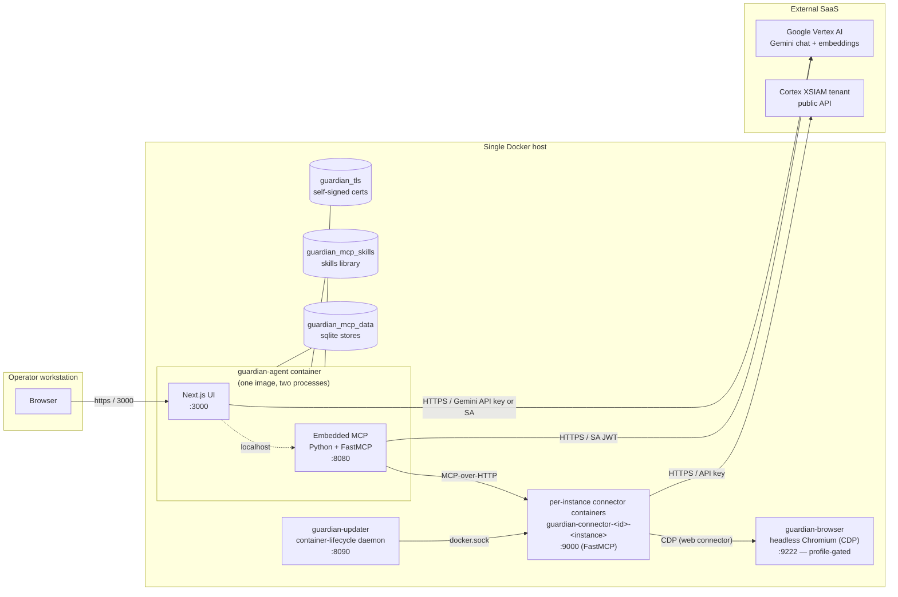
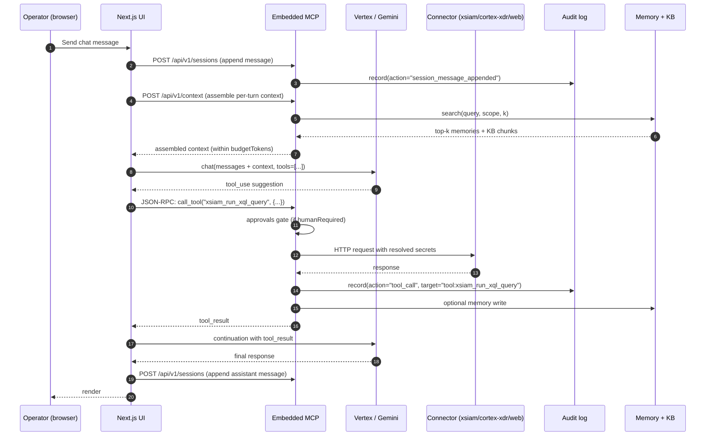
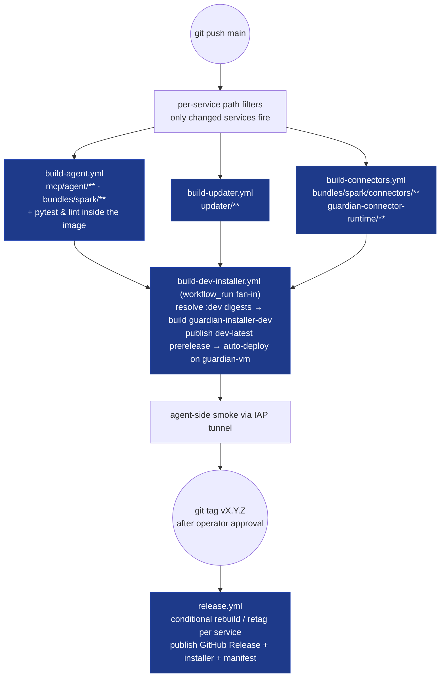

# Guardian — Architecture

Three views: deployment topology, runtime data flow, and the CI/CD pipeline. All diagrams are mermaid — render in GitHub directly or `npx @mermaid-js/mermaid-cli -i this.md -o this.svg` for offline copies.

---

## 1. Deployment topology

The shape that defines what's where, what talks to what, and which trust boundary each component lives in.

**Reading guide.**

- The dashed line between Next.js and MCP is `localhost` only — they live in the **same container**, share the same trust boundary. The MCP is part of the agent's image, not a sibling service, per the spark-agents v1.2 bundle spec.
- The two compose recipes in the repo correspond to two flavors of this diagram:
  - `docker-compose.yml` (repo root) — local dev: `guardian-agent` + the profile-gated `guardian-browser`, images tagged `:local`.
  - `installer/docker-compose.yml` — customer install: `guardian-agent` + `guardian-updater` + `guardian-browser`, images pinned by content digest. Per-instance connector containers are created dynamically by guardian-updater, not declared in compose.
- Volumes (`guardian_mcp_data`, `guardian_mcp_skills`, `guardian_tls`) survive container restarts AND `docker compose down`. Drop them only with `down -v` (destructive).

---

## 2. Runtime data flow

What happens between "operator types a chat message" and "agent makes a connector tool call".

**Key invariants.**

- **Phase 5 secret resolution at tool-call time.** The MCP holds only paths in its sqlite stores (`/secrets/agents/...`); the SecretStore is a mode-0700 file-backed vault. Secrets resolve from path → value at the moment a connector tool fires, never earlier. This is what makes the audit log safe to query even with admin token: there are no plaintext secrets anywhere in queryable storage.
- **Phase 6 audit trail.** Every state change leaves a row. The audit table is append-only at the storage layer (no DELETE/UPDATE in `SqliteAuditLog`). Even with admin token, an operator can't tamper with the log via HTTP.
- **Phase 7 approvals gate.** Tools listed in `manifest.approvals.humanRequired` block on `asyncio.Event` until the operator decides via `/api/v1/approvals/{id}/resolve`. The bus's boot-time orphan reaper marks zombie pending rows from a prior process as `STATUS_TIMEOUT`.
- **Phase 8 cognitive layer.** Sessions (episodic), memory (semantic), and context (per-turn working memory) are wired together via the `ContextAssembler`. Embeddings flow through `VertexEmbedder` (text-embedding-004) when configured, falling back to a deterministic `TextHashEmbedder` when no Vertex provider instance exists.
- **Phase 9 + 9b cron pipeline.** Scheduled jobs go through the same `fastmcp.Client(mcp)` dispatch path as agent-driven calls. The args block validates against the tool's Pydantic schema; mismatches surface as `job_failed` audit rows with the exact validation error.

---

## 3. CI/CD pipeline

Everything between `git push` on main and a published artifact. The full treatment (change scenarios, GHCR per-version access, failure modes) lives in [`CICD.md`](CICD.md); the diagram below is the shape.

**Notes.**

- **Only changed services rebuild.** Each per-service workflow has a `paths:` filter; a push touching only `mcp/agent/` leaves `build-updater.yml` and `build-connectors.yml` idle. Untouched services retag the previous digests at release time — same content digest, no container recreation on upgrade.
- Per-service builds + the dev installer run on the **self-hosted runner on guardian-vm**; `release.yml` runs on `ubuntu-latest`.
- `concurrency: cancel-in-progress: true` on the per-service builds means a new push to `main` cancels the previous run. Expected; you'll see "cancelled" entries in `gh run list` when a series of pushes lands within minutes.
- The release ships 9 images in lockstep at one `vX.Y.Z`: `guardian-agent`, `guardian-updater`, `guardian-browser`, `guardian-connector-runtime`, and the 5 per-connector images (`xsiam`, `cortex-xdr`, `web`, `cortex-docs`, `cortex-content`). See [`CICD.md` § Monorepo release invariant](CICD.md#monorepo-release-invariant).

---

## Capability inventory

For a flat list of "which spec capability is implemented where":

| Capability | Storage | API | Spec ref |
|---|---|---|---|
| Audit log | `audit.db` (append-only) | `/api/v1/audit*` | §6.10 row 14 |
| Approvals | `approvals.db` + asyncio | `/api/v1/approvals*` | §6.10 row 15 |
| Secrets | mode-0700 file vault | (resolved at tool-call) | §6.10 row 17 |
| Instances | `instances.db` (paths only) | `/api/v1/instances` | §7.5 |
| Providers | `provider_instances.db` (paths only) | `/api/v1/providers` | §7.6 |
| Sessions | `sessions.db` + `messages.db` | `/api/v1/sessions` | §6.10 sessions |
| Memory | `memory.db` (vec search, brute-force) | `/api/v1/memories` | §6.10 memory |
| Context | (in-process assembler) | `/api/v1/context` | §6.10 context |
| Knowledge | `kb.db` (per KB, hybrid search) | `/api/v1/kbs*` | §6.10 knowledge |
| Jobs | `jobs.db` + croniter | `/api/v1/jobs` | §6.10 jobs |
| Settings | `settings.db` (override layer) | `/api/v1/settings` | manifest.settings |
| API keys | `api_keys.db` (sha256 hashes) | `/api/v1/api_keys*` | external integration |
| Notifications | `notifications.db` + topic catalog | `/api/v1/notifications*` | manifest.notifications |
| Telemetry | `telemetry.db` (opt-in) | `/api/v1/telemetry*` | manifest.telemetry |
| Media | `media.db` + `<data_root>/media/<id>/` | `/api/v1/media*` | manifest.media |
| Metrics | in-process Prometheus registry | `/api/v1/metrics` | manifest.observability.metrics |
| A2UI streaming | bundled JSONL surfaces | `/api/v1/ui/*` | A2UI v0.8 |
