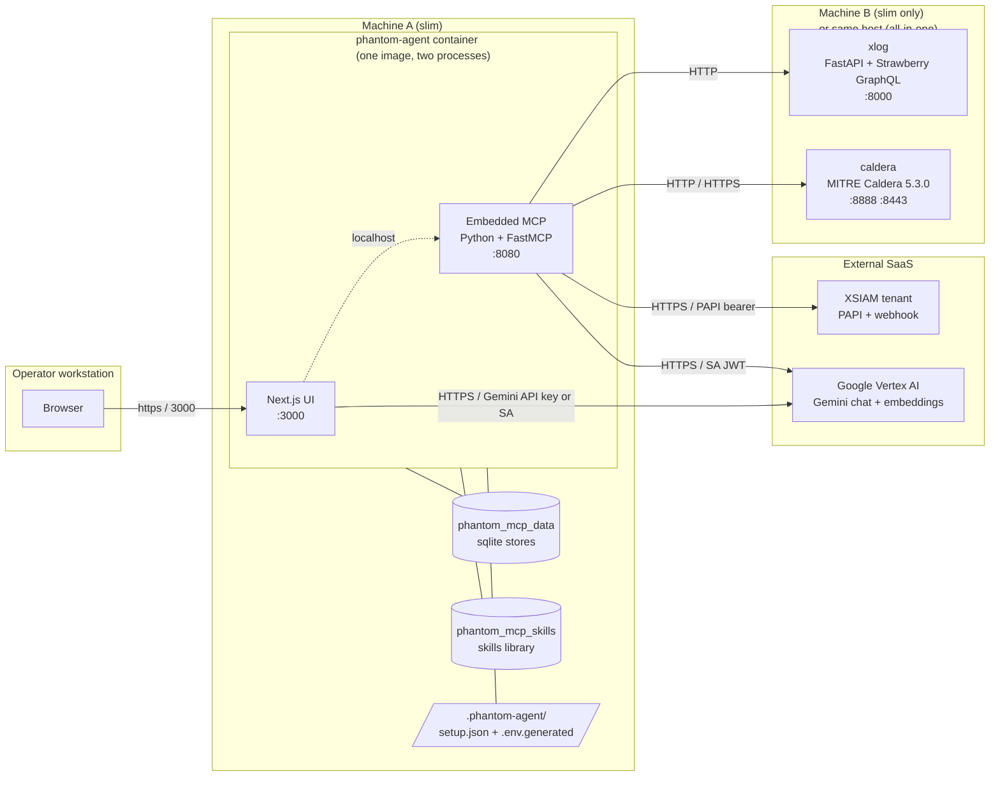
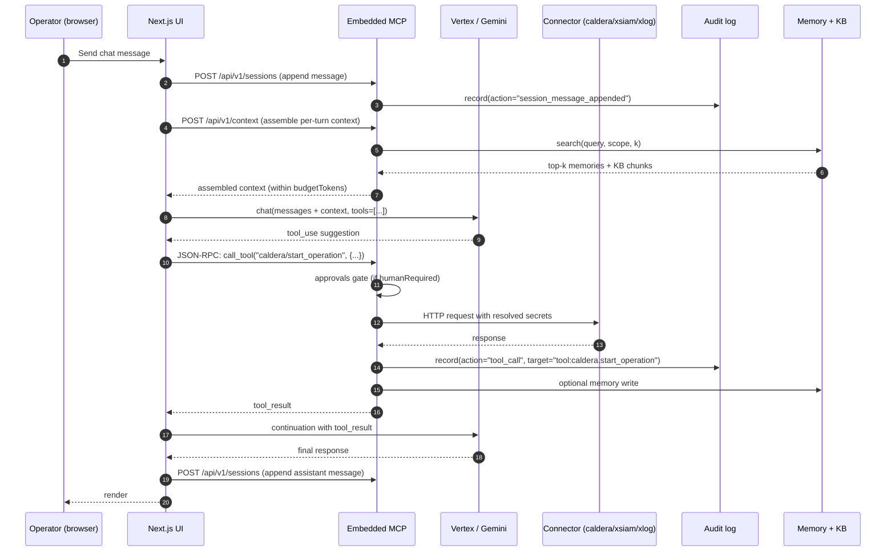
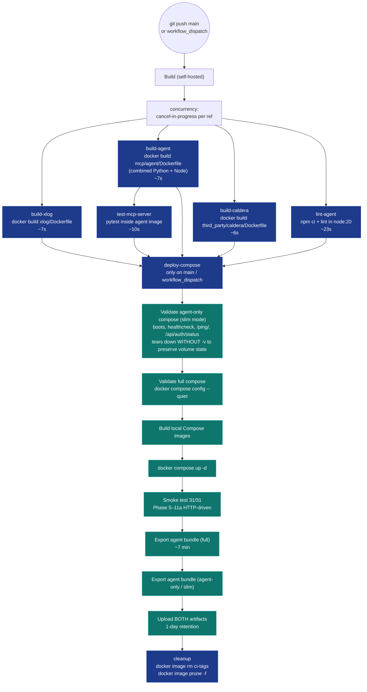

# Phantom — Architecture

Three views: deployment topology, runtime data flow, and the CI/CD pipeline. All diagrams are mermaid — render in GitHub directly or `npx @mermaid-js/mermaid-cli -i this.md -o this.svg` for offline copies.

---

## 1. Deployment topology

The shape that defines what's where, what talks to what, and which trust boundary each component lives in.

**Reading guide.**

- The dashed line between Next.js and MCP is `localhost` only — they live in the **same container**, share the same trust boundary. The MCP is part of the agent's image, not a sibling service. This is per the spark-agents v1.2 bundle spec and what makes the slim split-deploy bundle viable (one image to ship).
- The two compose recipes in the repo correspond to two arrangements of this diagram:
  - `docker-compose.yml` — Machine A and Machine B collapse into the same Docker network on one host (all-in-one).
  - `docker-compose.agent-only.yml` — Machine A only; Machine B is operated by another team and reached via HTTP at the URLs the operator types into the setup form.
- Volumes (`phantom_mcp_data`, `phantom_mcp_skills`) survive container restarts AND `docker compose down`. Drop them only with `down -v` (destructive). The `./.phantom-agent/` bind-mount holds the setup form's submitted values.

---

## 2. Runtime data flow

What happens between "operator types a chat message" and "agent makes a connector tool call".

**Key invariants.**

- **Phase 5 secret resolution at tool-call time.** The MCP holds only paths in its sqlite stores (`/secrets/agents/...`); the SecretStore is a mode-0700 file-backed vault. Secrets resolve from path → value at the moment a connector tool fires, never earlier. This is what makes the audit log safe to query even with admin token: there are no plaintext secrets anywhere in queryable storage.
- **Phase 6 audit trail.** Every state change leaves a row. The audit table is append-only at the storage layer (no DELETE/UPDATE in `SqliteAuditLog`). Even with admin token, an operator can't tamper with the log via HTTP.
- **Phase 7 approvals gate.** Tools listed in `manifest.approvals.humanRequired` block on `asyncio.Event` until the operator decides via `/api/v1/approvals/{id}/resolve`. The bus's boot-time orphan reaper marks zombie pending rows from a prior process as `STATUS_TIMEOUT`.
- **Phase 8 cognitive layer.** Sessions (episodic), memory (semantic), and context (per-turn working memory) are wired together via the `ContextAssembler`. Embeddings flow through `VertexEmbedder` (text-embedding-004) when configured, falling back to a deterministic `TextHashEmbedder` when no Vertex provider instance exists.
- **Phase 9 + 9b cron pipeline.** Scheduled jobs go through the same `fastmcp.Client(mcp)` dispatch path as agent-driven calls. The args block validates against the tool's Pydantic schema; mismatches surface as `job_failed` audit rows with the exact validation error.

---

## 3. CI/CD pipeline

Everything between `git push` on main and a published artifact.

**Notes.**

- `concurrency: cancel-in-progress: true` means a new push to `main` cancels the previous run. Expected; you'll see "cancelled" entries in `gh run list` when a series of pushes lands within minutes.
- `deploy-compose` only runs on `main` push or `workflow_dispatch` — PR validation stops at build/lint/test.
- The runner is **self-hosted on the phantom VM** (per `CLAUDE.md` workflow). Image artifacts are tagged `ci-${{ github.sha }}`; the cleanup job prunes them to keep disk pressure bounded.
- `REQUIRE_MCP_TOOL_SNAPSHOT=1` in the export steps means the snapshot generator must succeed (MCP must be reachable). `REQUIRE_FULL_TOOL_COVERAGE` is OFF by default — missing curated tools (typically because the runner's persistent state has partial connector instances) are warnings, not errors. Promote to `1` once CI programmatically bootstraps instance state.

---

## Capability inventory

For a flat list of "which spec capability is implemented where":

| Capability | Storage | API | Spec ref |
|---|---|---|---|
| Audit log | `audit.db` (append-only) | `/api/v1/audit*` | §6.10 row 14 |
| Approvals | `approvals.db` + asyncio | `/api/v1/approvals*` | §6.10 row 15 |
| Secrets | mode-0700 file vault | (resolved at tool-call) | §6.10 row 17 |
| Instances | `instances.db` (paths only) | `/api/v1/instances` | §7.5 |
| Providers | `provider_instances.db` (paths only) | `/api/v1/providers` | §7.6 |
| Sessions | `sessions.db` + `messages.db` | `/api/v1/sessions` | §6.10 sessions |
| Memory | `memory.db` (vec search, brute-force) | `/api/v1/memories` | §6.10 memory |
| Context | (in-process assembler) | `/api/v1/context` | §6.10 context |
| Knowledge | `kb.db` (per KB, hybrid search) | `/api/v1/kbs*` | §6.10 knowledge |
| Jobs | `jobs.db` + croniter | `/api/v1/jobs` | §6.10 jobs |
| Settings | `settings.db` (override layer) | `/api/v1/settings` | manifest.settings |
| API keys | `api_keys.db` (sha256 hashes) | `/api/v1/api_keys*` | external integration |
| Notifications | `notifications.db` + topic catalog | `/api/v1/notifications*` | manifest.notifications |
| Telemetry | `telemetry.db` (opt-in) | `/api/v1/telemetry*` | manifest.telemetry |
| Media | `media.db` + `<data_root>/media/<id>/` | `/api/v1/media*` | manifest.media |
| Metrics | in-process Prometheus registry | `/api/v1/metrics` | manifest.observability.metrics |
| A2UI streaming | bundled JSONL surfaces | `/api/v1/ui/*` | A2UI v0.8 |
